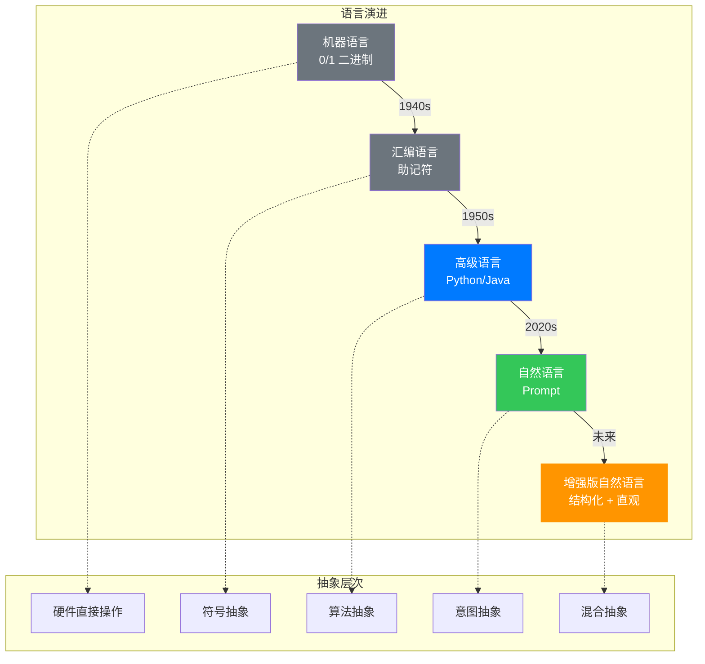

## 前言：光标闪烁的岁月

曾经在 Linux 终端下敲了多年命令，Shell 脚本、Bash、Markdown 这些东西太熟悉了。所以当看到满屏都在讨论 AI Agent、Skills、Claude Code、OpenCode 时，一种夹杂着怀旧和欣喜，熟悉又陌生的感觉，难以抑制地涌上心头。

那些年，我们在黑底白字的终端里，光标一闪一闪，等待着精确的指令。而如今，同样的屏幕上，AI 正用自然语言和我们聊天。这不仅是工具的更迭，更是一场人机交互方式的根本性变革。

---

## 第一章：极客乐园与大众鸿沟

### 1.1 工具的双重属性

搞技术的人很多都喜欢 Shell 和命令行。管道符一串，几个工具配合起来，什么活都能干。这种体验有点像演奏乐器——当你熟练掌握了 `grep`、`awk`、`sed` 这些"音符"，就能组合出无限的可能。

但问题是，这套东西对普通人来说太劝退了。黑底白字，光标一闪一闪，不知道该输入什么——这种恐惧感，就像让一个从未摸过乐器的人站在舞台中央。

看看对比就明白了：

**Bash 命令：**
```bash
grep -i "error" log.txt | awk '{print $1,$4}' | sort | uniq -c
```

**AI Prompt：**
```
帮我在日志文件中找出所有包含"error"的行，统计每个错误的发生次数
```

前者要记一堆命令和参数，输错一个字母就报错；后者直接说人话，交给 AI 来理解你到底要干嘛。这背后反映的是两种不同的哲学：

- **命令行范式**：精确、可预期、零歧义，但学习曲线陡峭
- **自然语言范式**：模糊、容错、对话式，但需要 AI 理解能力

从信息论的角度看，命令行是**低熵高信噪比**的交流方式，而自然语言是**高熵高冗余**的表达。前者追求效率，后者追求易用性。

### 1.2 大众产品的必经之路

单靠技术本身不够，把所有功能都做成按钮和菜单，点一点就能用。这才叫大众产品——把核心功能藏在优雅的交互界面后面，而不是让用户先上一门 Linux 入门课。

这里有一个有趣的权衡。如果我们用数学语言描述，可以定义一个**可用性函数**：

$$
U = \alpha \cdot E - \beta \cdot L - \gamma \cdot C
$$

其中：
- $U$ 是可用性评分
- $E$ 是任务完成效率
- $L$ 是学习成本
- $C$ 是认知负荷
- $\alpha, \beta, \gamma$ 是权重系数

命令行工具的 $E$ 很高，但 $L$ 和 $C$ 也高；AI Agent 的 $E$ 可能略低（因为偶尔理解错），但 $L$ 和 $C$ 显著降低。对于普通用户，这个函数的最优解显然偏向后者。

---

## 第二章：核心概念解析

### 2.1 Prompts：从"指令"到"意图"

把 AI 想象成实习生，Prompt 就是你的任务书。

用 Shell 的时候，参数输错一个字符就等着报错。Prompt 好在你能用自然语言说事儿，但坏在——你得说清楚。与机器对话比跟人说话还累，因为它不懂暗示，也不懂什么"语境"。

这个变化挺有意思的：以前要告诉计算机"怎么做"，现在只需要说"要什么"。但说清楚"要什么"，有时候比列出具体步骤还难。

我们可以用**信息熵**的概念来理解：

$$
H(P) = -\sum_{i=1}^{n} P(x_i) \log_2 P(x_i)
$$

命令行的每个字符都携带确定的信息，熵值接近理论最小值。而自然语言充满冗余、歧义、隐喻，熵值高得多。AI 的能力，就是从这些高熵输入中提取有效信息。

### 2.2 Agent：会自己想办法的程序

Agent 现在很火。它和普通程序最大的区别就是能自己决策。

Bash 脚本写好是什么样，执行就是什么样。Agent 不一样，它会看情况决定下一步干啥——是去搜索一下，还是跑段 Python 代码。

大概就像：
- **传统脚本**：火车，铁轨铺好哪样走就哪样走
- **Agent**：探险家，告诉目的地，但路上怎么走他自己看着办

这东西好玩是好玩的，但 unpredictable，至少目前还没那么高的精度。

从计算理论的角度看，传统脚本是**确定性图灵机**的实例化，而 Agent 更接近**非确定性图灵机**——每个决策点都可能有多个分支，具体选择取决于上下文和推理。

### 2.3 Skills：工具箱

Agent 是大脑，Skills 就是手脚。

Linux 里各种小工具，grep、awk、sed 之类的。AI 这边也一样，"读 PDF"、"查天气"、"连数据库"这些功能都叫 Skills。

Unix 有个原则：一个工具只做一件事，把它做好。这个道理放到 AI 也一样——Skill 好不好用，看它专不专注、能不能组合起来用。

我们可以将 Skills 看作一个**函数集合**：

$$
\mathcal{S} = \{f_1, f_2, \ldots, f_n\}
$$

每个 $f_i: \mathcal{X}_i \to \mathcal{Y}_i$ 是一个特定功能的映射。Agent 的能力边界，取决于它能组合调用多少个这样的 $f_i$。

### 2.4 MCP：连接标准

MCP 是 Anthropic 最近在推的一个协议。可以把它想成 AI 界的 USB。

以前每个 AI 工具都要自己写适配器连各种数据源。MCP 想做的事，就是定个标准，让所有 AI 模型都能方便地连本地文件、GitHub、Google Drive 这些东西。

这种标准化挺有美感的。USB 让所有外设都能即插即用，MCP 也是这个道理。

从系统工程角度看，MCP 定义了一个**标准接口层**：

$$
I = \{(protocol, version, endpoint)\}
$$

有了这个标准，任何 Agent 都可以通过统一的接口访问不同的数据源，而不需要为每个数据源单独编写适配器。

---

## 第三章：Perl 在 Agent 时代的思考

说到极客工具，绕不开 Perl。这门语言当年叫"瑞士军刀"，文本处理几乎一统江湖。

那么 Perl 在 Agent 时代会不会翻红？

我觉得有点难。

**Perl 的优势：**
- 文本处理强，跟 NLP 挺搭的
- "条条大路通罗马"的哲学，跟 AI 生成的思路合拍
- CPAN 生态丰富，可以当 Skills 用

**但问题也多：**
- 太灵活了，代码难维护。AI 系统要可解释，这玩意是个劣势
- 社区也不如当年活跃，新人都去写 Python、Go 了

**更可能的情况**：Perl 本身不会复活，但它那种"怎么快怎么来"的精神会留下来。未来的 Agent 生成脚本时，可能会借鉴 Perl 的思路——不管优雅不优雅，能解决问题就行。

也许，旧技术很少真正死掉。要么被集成进新东西，要么在特定领域继续发光。

这让我想起**演化论中的"红皇后假说"**——物种必须持续进化才能保持相对适应度。技术也是如此：Perl 虽然不再主流，但它的基因早已扩散到 Python、Ruby 等后继语言中。

---

## 第四章：效率与普适性的平衡

技术实现和用户价值和实际体验之间，往往隔着一大片空地。要不然那啥 M* 虽然被称为是套壳，但是架不住用户喜欢，还能卖个好价钱呢，归根结底，不还是因为很多技术没有或者产品没有服务好用户么！

### 4.1 两类用户的博弈

**极客要什么**：灵活、可控、日志详细、文档齐全。最好每个细节都能调。

**普通用户要什么**：点两下就能用，出错有提示，不需要懂底层原理。

这两拨人需求不一样，产品路线也不一样：

- 给极客用的工具：配置项拉满，日志该有就有，文档写得清清楚楚
- 给大众用的工具：默认配置就够用，引导友好，容错性强

**做 AI Agent 的人，最该想的不是攒了多少 Skills，而是这些东西能不能让普通人用起来。**

堆再多功能，用户上手不了，阳春白雪。

### 4.2 技术 diffusion 的过程

从创新扩散理论看，任何新技术都会经历五个阶段：
1. **创新者**（Innovators）：极客，愿意尝鲜
2. **早期采用者**（Early Adopters）：技术敏感人群
3. **早期大众**（Early Majority）：实用主义者
4. **晚期大众**（Late Majority）：保守派
5. **落后者**（Laggards）：最后才接受

Shell 停留在第 1-2 阶段，而 AI Agent 有机会跨越鸿沟，真正触达第 3-5 阶段。这其中的关键，就是**降低认知门槛**。

我们可以用**学习曲线**来描述：

$$
T(t) = T_0 \cdot e^{-\lambda t}
$$

其中 $T(t)$ 是达到熟练使用所需的时间，$\lambda$ 是工具的"易用性系数"。命令行的 $\lambda$ 很小（学习慢），而 AI Agent 的 $\lambda$ 更大（上手快）。

---

## 第五章：自然语言是终局吗？

现在用 AI Agent，本质上还是用自然语言指挥命令行和工具。那以后会不会完全不需要记命令、写脚本，全靠说话就搞定？

这得分开看。

### 5.1 操作层面的可能

**操作层面**：有可能。就像现在没人用汇编写程序一样，自然语言可能成为通用的交互方式。

这种转变，类似于从**机器语言**到**高级语言**的跨越。每一次抽象层的提升，都让更多人能够参与创造。

### 5.2 底层思维的不变

**但思维层面（底层）**：难说。

**1. 精确性需求不会消失**

工程、科学、金融这些领域，自然语言描述太模糊了。你不会用大白话写数学公式，形式化的表达还是需要的。

$$
\nabla \cdot \mathbf{E} = \frac{\rho}{\varepsilon_0}
$$

这个麦克斯韦方程组，用自然语言描述需要几百字，而且容易出现歧义。数学语言的价值，就在于它的**精确性**和**无歧义性**。

**2. 专业领域有专业语言**

音乐家要乐谱，建筑师要图纸，这些表达方式是几百年磨出来的，自然语言替代不了。

每种专业语言都是一种**高度压缩的表示系统**：

$$
I_{compressed} \ll I_{natural\_language}
$$

但通过专业训练，解码效率极高。

**3. 调试和可解释性**

AI 干错了活儿，你得知道它咋想的。光看自然语言描述，可能搞不清楚到底哪里出了问题。

这涉及**可解释性 AI**（XAI）的核心挑战：我们需要一种方式，让 AI 的决策过程对人类透明。

### 5.3 增强版自然语言

**更可能的未来**：出现一种"增强版自然语言"——比自然语言结构化一些，但又不像编程语言那么死板。

就像 Markdown 之于 HTML。Markdown 让非技术人员也能写出结构化文档，未来的机器交互语言，可能是"简化版编程 + 增强版自然语言"的混合体。

我们可以将其形式化为：

$$
\mathcal{L}_{future} = \alpha \cdot \mathcal{L}_{natural} + \beta \cdot \mathcal{L}_{formal} + \gamma \cdot \mathcal{L}_{visual}
$$

其中：
- $\mathcal{L}_{natural}$ 是自然语言的灵活性和表达能力
- $\mathcal{L}_{formal}$ 是形式化语言的精确性和可推理性
- $\mathcal{L}_{visual}$ 是视觉元素的直观性
- $\alpha, \beta, \gamma$ 是权重，随场景动态调整



---

## 第六章：技术到底在解决什么问题

技术浪潮一波接一波，从 Linux 到 AI Agent，本质上都是关于"效率"。

**工具好不好用，看两点**：解决了谁的问题，解决得是否优雅、容易上手。

这波 AI 浪潮里，我们既需要精通命令行的极客，也需要能把极客那套翻译给大众听的"架构师"。

如果我们定义一个**价值函数**：

$$
V = \int_{0}^{T} \frac{\text{Output}(t)}{\text{Effort}(t)} dt
$$

其中 Output 是产出，Effort 是投入的努力。技术的目标，就是最大化这个积分。命令行和 AI Agent，只是最大化路径的不同选择罢了。

---

## 结语：变与不变

从 Shell 到 Agent，从命令行到自然语言，技术在变，想提高效率的需求没变。

那些在终端里敲命令的日子，那些为了一个参数翻半天文档的夜晚，那些写完脚本第一次运行成功的兴奋——这些都成了记忆。但记忆的价值，不在于怀旧，而在于它帮我们理解：**技术的每一次进步，都是为了让人类的意图更直接地变成现实**。

未来可能还会有新的浪潮，也许今天讨论的 AI Agent 也会成为某种"怀旧"。但有些东西是不变的：对效率的追求，对优雅的向往，以及对让技术服务于人的终极目标的坚持。

正如物理学家费曼所说：*"Things that you can't have too many of are: good friends, good books, and good tools."*

工具在变，但我们需要好工具的心，从未改变。

---

**（本文所有观点，均由本人及所使用的 AI 工具产生，与一切公司和实体机构无关）**

---

## 参考文献与延伸阅读

1. Raymond, E. S. (2004). *The Art of Unix Programming*. Addison-Wesley.

2. Russell, S., & Norvig, P. (2020). *Artificial Intelligence: A Modern Approach* (4th ed.). Pearson.

3. Shannon, C. E. (1948). A Mathematical Theory of Communication. *Bell System Technical Journal*, 27(3), 379-423.

4. Rogers, E. M. (2003). *Diffusion of Innovations* (5th ed.). Free Press.

5. Anthropic. (2024). *Model Context Protocol (MCP) Specification*.

6. Wolfram, S. (2023). What Is ChatGPT Doing ... and Why Does It Work? *Stephen Wolfram Writings*.

---

## 附录：技术术语对照表

| 英文术语 | 中文翻译 | 数学/技术含义 |
|---------|---------|--------------|
| Shell | 命令行 shell | $S = \{cmd_1, cmd_2, \ldots\}$ 命令集合 |
| Agent | 智能代理 | 自主决策的软件实体 |
| Prompt | 提示词 | 自然语言形式的任务描述 |
| Skills | 技能/工具 | 函数 $f: \mathcal{X} \to \mathcal{Y}$ |
| MCP | 模型上下文协议 | 标准化接口层 $I$ |
| Entropy | 熵 | $H(P) = -\sum P \log P$ 信息量度量 |
| Diffusion | 扩散/传播 | 技术普及的社会过程 |
