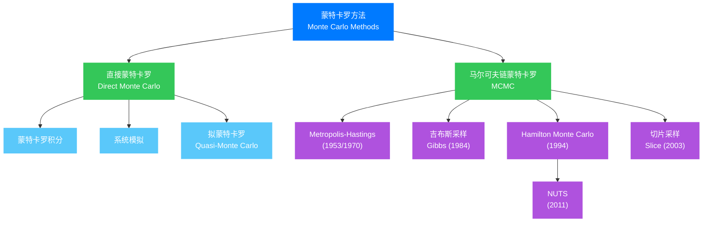

## 引言：掷骰子解方程

想象一下，有人告诉你：要计算一个复杂的定积分，不需要微积分，只需要掷足够多的骰子。你大概会觉得这个人疯了。然而，这正是二十世纪最伟大的计算方法之一——**蒙特卡罗方法**（Monte Carlo Method）的核心思想。

当我们面对那些传统方法难以处理的高维积分、复杂系统的模拟或者无法解析求解的概率问题时，蒙特卡罗方法给出了一个看似简单却深刻的答案：**用随机性来求解确定性问题**。这种方法已经深入到科学的方方面面——从核物理到金融工程，从生物进化到人工智能，无处不见它的身影。

让我们从一个最经典的例子开始：如何用"扔针"来计算 $\pi$ 的值。

## 第一章：蒙特卡罗的诞生——曼哈顿计划的秘密代号

### 1.1 摩纳哥的赌场与原子弹的秘密

"蒙特卡罗"这个名字，源自摩纳哥著名的赌城。1940 年代，在洛斯阿拉莫斯实验室，一群顶尖的科学家正在紧锣密鼓地研制世界上第一颗原子弹。在这个属于"曼哈顿计划"的绝密基地里，数学家约翰·冯·诺伊曼（John von Neumann）和斯坦尼斯拉夫·乌拉姆（Stanislaw Ulam）正在研究核裂变中的中子扩散问题。

这个问题极其复杂：中子在原子弹内部的行为是随机的，它们可能被原子核捕获，可能引发新的裂变，也可能逃逸出去。传统的方法根本无法处理这种复杂的随机过程。

乌拉姆后来回忆起他是如何产生这个想法的：

> "当时我正因病康复，在玩纸牌接龙。我开始思考：如果把牌随机排列一百次，大概有多少次能成功接龙？相比于把所有可能的情况都计算出来，直接实验似乎更容易..."

这个看似简单的想法，孕育了一个全新的计算方法。由于这种方法涉及随机性，而蒙特卡罗又以赌场闻名，冯·诺伊曼就给它起了"蒙特卡罗"这个代号——既是保密的需要，也恰如其分地描述了方法的本质。

### 1.2 早期的思想萌芽

虽然蒙特卡罗方法在1940年代才正式命名，但用随机性来解决确定性问题的思想古已有之。

**1777年，布丰投针实验**

法国数学家乔治-路易·勒克莱尔，布丰伯爵（Georges-Louis Leclerc, Comte de Buffon）提出了第一个著名的随机实验：

在一张画满平行线的纸（线间距为 $d$）上随机投掷一根长度为 $l$ 的针（$l < d$），针与任意一条平行线相交的概率是多少？

布丰证明了，这个概率是：

$$
P = \frac{2l}{\pi d}
$$

这给出了一个计算 $\pi$ 的方法：如果我们投掷针 $N$ 次，其中 $n$ 次与线相交，那么：

$$
\frac{n}{N} \approx \frac{2l}{\pi d} \implies \pi \approx \frac{2lN}{nd}
$$

这个实验被多次验证：1850年，沃尔夫在苏黎世投掷了5000次，得到 $\pi \approx 3.1596$；1901年，拉泽里尼投掷3408次，甚至得到了精确到小数点后6位的 $\pi$ 值（虽然有人怀疑他可能"选择性记录"了结果）。

**19世纪末的统计学革命**

随着统计学的发展，卡尔·皮尔逊（Karl Pearson）等人开始使用随机抽样来解决统计问题。但这些方法仍然主要用于验证已知的结果，而不是作为通用的计算工具。

## 第二章：数学基础——为什么随机性有效？

要理解蒙特卡罗方法，我们需要先理解它的数学基础。这一切都建立在**大数定律**和**中心极限定理**这两大概率论支柱之上。

### 2.1 大数定律：频率的稳定性

**强大数定律**告诉我们：如果 $X_1, X_2, \ldots$ 是独立同分布的随机变量，期望为 $\mu$，方差有限，那么：

$$
\lim_{N \to \infty} \frac{1}{N}\sum_{i=1}^{N} X_i = \mu \quad \text{几乎必然成立}
$$

用通俗的话说：**当试验次数足够多时，样本平均值会收敛到真实期望值**。

这正是蒙特卡罗方法的核心！如果我们能够把一个待求解的问题转化为某个随机变量的期望计算，那么通过大量的随机抽样，我们就可以得到这个期望的近似值。

### 2.2 中心极限定理：误差的估计

大数定律告诉我们蒙特卡罗方法**最终会收敛**，但中心极限定理告诉我们**收敛的速度**。

设 $X_1, X_2, \ldots, X_N$ 是独立同分布的随机变量，期望为 $\mu$，方差为 $\sigma^2$。定义样本均值为：

$$
\bar{X}_N = \frac{1}{N}\sum_{i=1}^{N} X_i
$$

中心极限定理告诉我们：

$$
\frac{\sqrt{N}(\bar{X}_N - \mu)}{\sigma} \xrightarrow{d} \mathcal{N}(0, 1)
$$

这意味着对于大 $N$，$\bar{X}_N$ 近似服从正态分布 $\mathcal{N}(\mu, \sigma^2/N)$。

这个结果极其重要，因为它给出了**误差估计**：

- 标准误差是 $\sigma/\sqrt{N}$
- 95% 置信区间大约是 $\mu \pm 1.96\sigma/\sqrt{N}$

注意到一个关键事实：**误差以 $1/\sqrt{N}$ 的速度下降**。这意味着：

- 要把精度提高10倍，需要100倍的样本
- 要把精度提高100倍，需要10000倍的样本

这看起来似乎很慢，但我们稍后会看到，在高维问题中，这已经是非常优秀的收敛速度了。

### 2.3 蒙特卡罗积分的基本原理

让我们看看如何用蒙特卡罗方法计算定积分。假设我们要计算：

$$
I = \int_{a}^{b} f(x) \, dx
$$

我们可以把它改写为期望的形式：

$$
I = \int_{a}^{b} f(x) \, dx = (b-a) \int_{a}^{b} f(x) \cdot \frac{1}{b-a} \, dx = (b-a) \cdot \mathbb{E}[f(X)]
$$

其中 $X$ 是在 $[a, b]$ 上均匀分布的随机变量。

蒙特卡罗方法的做法是：

1. 生成 $N$ 个在 $[a, b]$ 上均匀分布的随机点 $X_1, X_2, \ldots, X_N$
2. 计算 $I_N = \frac{b-a}{N}\sum_{i=1}^{N} f(X_i)$

根据大数定律，$I_N \to I$ 当 $N \to \infty$。

**高维积分的情况**

蒙特卡罗方法的真正威力在高维积分中体现。考虑 $d$ 维积分：

$$
I = \int_{[0,1]^d} f(\mathbf{x}) \, d\mathbf{x}
$$

传统的数值积分方法（如梯形法则、辛普森法则）在 $d$ 维空间中的误差通常是 $O(N^{-2/d})$，这意味着随着维度 $d$ 的增加，收敛速度急剧下降——这就是著名的**维度灾难**（Curse of Dimensionality）。

而蒙特卡罗方法的误差是 $O(N^{-1/2})$，**与维度无关**！这是蒙特卡罗方法在高维问题中无可替代的根本原因。

## 第三章：蒙特卡罗方法的发展历程

### 3.1 初创时期（1940-1950年代）

**洛斯阿拉莫斯的突破**

在曼哈顿计划中，蒙特卡罗方法被用于解决中子输运问题。冯·诺伊曼和乌拉姆开发了一套完整的算法框架，包括：

- 重要抽样（Importance Sampling）：让随机抽样更加"聪明"
- 分层抽样（Stratified Sampling）：把样本空间分区以提高精度

**第一台计算机的助力**

有趣的是，蒙特卡罗方法的兴起与电子计算机的诞生几乎是同步的。在ENIAC上运行的早期蒙特卡罗模拟，第一次让科学家们看到了这种方法的巨大潜力。

### 3.2 方法的成熟（1960-1980年代）

**梅特罗波利斯算法（1953）**

尼古拉斯·梅特罗波利斯（Nicholas Metropolis）等人提出了**梅特罗波利斯算法**，这是第一个**马尔可夫链蒙特卡罗**（MCMC）方法。这个算法可以从复杂的概率分布中抽样，为统计物理和贝叶斯统计打开了新的大门。

算法非常优雅：

1. 从当前状态 $x$ 开始
2. 提议一个新状态 $x' = x + \delta$（$\delta$ 是随机扰动）
3. 计算接受概率 $\alpha = \min\left(1, \frac{p(x')}{p(x)}\right)$，其中 $p$ 是目标分布
4. 以概率 $\alpha$ 接受新状态，否则保持原状态
5. 重复

这个简单的规则保证了马尔可夫链会收敛到目标分布 $p(x)$！

**哈斯廷斯的扩展（1970）**

W.K. Hastings将梅特罗波利斯算法推广到更一般的情况，形成了现在广泛使用的**Metropolis-Hastings算法**。

### 3.3 现代发展（1980年代至今）

**吉布斯采样（1984）**

Geman兄弟提出的**吉布斯采样**（Gibbs Sampling）简化了MCMC的实现，特别适合高维问题。在每次迭代中，它只更新一个变量，而保持其他变量不变。


**No-U-Turn Sampler（NUTS, 2011）**

随着计算机性能的提升，更复杂的MCMC方法被提出。NUTS是Hamilton Monte Carlo的一个自适应版本，它能自动选择合适的步长，大大提高了贝叶斯推断的效率。现在流行的概率编程框架Stan就使用了NUTS。

### 3.4 蒙特卡罗方法家族谱系



## 第四章：经典应用举例

### 4.1 计算π值：布丰投针的现代实现

让我们用现代蒙特卡罗方法来计算 $\pi$。这里使用一个更直观的方法：在单位正方形内随机投点，计算落在内切圆中的比例。

$$
\frac{\text{圆内点数}}{\text{总点数}} \approx \frac{\pi \cdot 1^2}{2 \times 2} = \frac{\pi}{4}
$$

因此：

$$
\pi \approx 4 \times \frac{\text{圆内点数}}{\text{总点数}}
$$

算法步骤：

1. 在 $[-1, 1] \times [-1, 1]$ 的正方形内随机生成 $N$ 个点
2. 统计满足 $x^2 + y^2 \leq 1$ 的点的数量 $n$
3. 计算 $\pi \approx 4n/N$

```python
import numpy as np

def estimate_pi(N):
    points = np.random.uniform(-1, 1, size=(N, 2))
    inside = np.sum(points[:, 0]**2 + points[:, 1]**2 <= 1)
    return 4 * inside / N

for N in [1000, 10000, 100000, 1000000]:
    print(f"N = {N:7d}, π ≈ {estimate_pi(N):.6f}")
```

随着 $N$ 的增加，估计值会逐渐收敛到 $\pi$ 的真实值。

### 4.2 金融工程：期权定价

**布莱克-舒尔斯-默顿模型**

1973年，布莱克、舒尔斯和默顿提出了期权定价的解析公式，但这基于许多简化假设。对于更复杂的衍生品（如美式期权、路径依赖期权），蒙特卡罗模拟几乎是唯一可行的方法。

**几何布朗运动模型**

假设股票价格 $S_t$ 服从几何布朗运动：

$$
dS_t = \mu S_t dt + \sigma S_t dW_t
$$

其中 $W_t$ 是标准布朗运动。欧式看涨期权的收益是 $\max(S_T - K, 0)$，其中 $K$ 是行权价，$T$ 是到期时间。

蒙特卡罗定价方法：

1. 模拟 $N$ 条股票价格路径
2. 对每条路径计算期权收益
3. 计算收益的期望值并折现

离散化后，股票价格的模拟公式为：

$$
S_{t+\Delta t} = S_t \exp\left[\left(\mu - \frac{\sigma^2}{2}\right)\Delta t + \sigma\sqrt{\Delta t} \cdot Z\right]
$$

其中 $Z \sim \mathcal{N}(0, 1)$。

```python
def asian_option_price(S0, K, T, r, sigma, N_paths=100000):
    """亚式期权定价的蒙特卡罗方法"""
    dt = 1/252  # 每日
    steps = int(T * 252)

    prices = np.zeros((N_paths, steps + 1))
    prices[:, 0] = S0

    for t in range(steps):
        Z = np.random.standard_normal(N_paths)
        prices[:, t + 1] = prices[:, t] * np.exp(
            (r - 0.5 * sigma**2) * dt + sigma * np.sqrt(dt) * Z
        )

    # 亚式期权：依赖于平均价格
    avg_prices = np.mean(prices[:, 1:], axis=1)
    payoffs = np.maximum(avg_prices - K, 0)
    price = np.exp(-r * T) * np.mean(payoffs)

    return price
```

### 4.3 物理模拟：粒子输运

蒙特卡罗方法在核物理中的应用是它的起源。中子在反应堆中的行为可以用以下过程模拟：

1. **源抽样**：中子从裂变源产生，具有随机的初始位置和方向
2. **输运**：中子以直线运动，直到碰撞
3. **碰撞**：
   - 被原子核捕获
   - 散射（改变方向）
   - 引发裂变（产生新中子）
4. **泄漏或吸收**：中子逃逸系统或被吸收

每个中子的历史都是一个随机过程，通过模拟大量中子，我们可以估计：
- 临界参数（反应堆能否维持链式反应）
- 功率分布
- 屏蔽效率

### 4.4 机器学习：MCMC与贝叶斯推断

**贝叶斯推断的核心问题**

在贝叶斯统计中，我们需要计算后验分布：

$$
p(\theta | D) = \frac{p(D | \theta) p(\theta)}{\int p(D | \theta) p(\theta) d\theta}
$$

其中分母（证据因子）的积分通常难以计算。MCMC方法让我们可以从后验分布中直接抽样，而不需要计算这个积分。

**应用示例：Logistic回归的贝叶斯推断**

```python
def logistic(X, beta):
    return 1 / (1 + np.exp(-X @ beta))

def log_likelihood(beta, X, y):
    p = logistic(X, beta)
    return np.sum(y * np.log(p) + (1 - y) * np.log(1 - p))

def log_prior(beta):
    return np.sum(-0.5 * beta**2)  # 标准正态先验

def metropolis_hastings(X, y, n_samples=10000, burn_in=1000):
    n_features = X.shape[1]
    beta = np.zeros(n_features)
    samples = []

    for i in range(n_samples + burn_in):
        # 提议新的beta值
        beta_new = beta + np.random.normal(0, 0.1, n_features)

        # 计算接受概率
        log_ratio = (log_likelihood(beta_new, X, y) + log_prior(beta_new) -
                     log_likelihood(beta, X, y) - log_prior(beta))

        if np.log(np.random.uniform()) < log_ratio:
            beta = beta_new

        if i >= burn_in:
            samples.append(beta.copy())

    return np.array(samples)
```

**强化学习中的蒙特卡罗方法**

蒙特卡罗方法在强化学习中也有重要应用。在蒙特卡罗策略评估中，我们通过完整episode的回报来估计状态值：

$$
V(s) = \mathbb{E}[G_t | S_t = s]
$$

其中 $G_t = R_{t+1} + \gamma R_{t+2} + \gamma^2 R_{t+3} + \cdots$ 是累积回报。

通过多次运行episode并计算平均回报，我们可以估计每个状态的价值函数。

### 4.5 其他重要应用

**计算生物学：蛋白质折叠**

蛋白质的三维结构决定了它的功能。预测蛋白质结构需要在巨大的构象空间中搜索，蒙特卡罗方法（特别是Metropolis准则）是核心工具之一。

**计算机图形学：光线追踪**

在渲染真实感图像时，需要计算光线的积分方程。蒙特卡罗光线跟踪通过随机采样光线方向来模拟全局光照效果，产生了电影级的视觉效果。

**运筹学：排队系统模拟**

银行柜台、客服中心、医院急诊室等排队系统的优化，需要模拟顾客到达、服务时间、队列行为等随机过程。蒙特卡罗模拟是评估不同方案的标准工具。

## 第五章：高级技巧与优化

基础的蒙特卡罗方法虽然强大，但有时收敛速度太慢。下面介绍几种常用的优化技巧。

### 5.1 重要抽样

基本思想：如果我们知道函数在某些区域更重要，就应该在这些区域多抽样。

考虑计算期望：

$$
\mathbb{E}_{p}[f(X)] = \int f(x) p(x) dx = \int \frac{f(x) p(x)}{q(x)} q(x) dx = \mathbb{E}_{q}\left[\frac{f(X) p(X)}{q(X)}\right]
$$

如果我们选择一个与 $|f(x)| p(x)$ 成比例的分布 $q(x)$，方差可以显著减小。

### 5.2 分层抽样

将样本空间分成若干层（strata），每层单独抽样：

$$
\mathbb{E}[f(X)] = \sum_{h=1}^{H} P(h) \cdot \mathbb{E}[f(X) | h]
$$

其中 $P(h)$ 是落在第 $h$ 层的概率。这样可以保证样本在各层均匀分布。

### 5.3 拟蒙特卡罗方法

拟蒙特卡罗方法使用**确定性**的低差异序列（如Sobol序列、Halton序列）替代随机序列。这些序列在空间中分布更加均匀，可以加速收敛到 $O(N^{-1} \log^d N)$。

### 5.4 方差缩减技术对比


## 第六章：蒙特卡罗方法在人工智能中的应用

### 6.1 蒙特卡罗树搜索（MCTS）

2006年提出的蒙特卡罗树搜索彻底改变了计算机博弈。AlphaGo的核心就是深度学习与MCTS的结合。

MCTS有四个步骤：


**UCB1公式**（Upper Confidence Bound）：

$$
\text{UCB1}(i) = \frac{W_i}{N_i} + c \sqrt{\frac{\ln N}{N_i}}
$$

其中 $W_i$ 是节点 $i$ 的胜率，$N_i$ 是访问次数，$N$ 是父节点访问次数，$c$ 是探索参数。

这个公式平衡了**利用**（exploitation，选择胜率高的节点）和**探索**（exploration，选择访问少的节点）。

### 6.2 变分推断与MCMC的比较

在现代贝叶斯机器学习中，有两种主要的推断方法：

| 特性 | MCMC | 变分推断 |
|------|------|----------|
| 精度 | 渐近精确 | 近似 |
| 速度 | 慢 | 快 |
| 可扩展性 | 有限 | 强 |
| 适用场景 | 小数据，精确性要求高 | 大数据，实时应用 |

随着计算资源的增加，MCMC方法在机器学习中的应用正在复兴。

### 6.3 强化学习中的蒙特卡罗方法

**蒙特卡罗策略梯度**

REINFORCE算法是策略梯度方法的基础：

$$
\nabla J(\theta) = \mathbb{E}_{\pi_\theta}\left[\frac{\nabla \pi_\theta(a|s)}{\pi_\theta(a|s)} G_t\right]
$$

使用蒙特卡罗回报 $G_t$ 作为梯度估计：

$$
\hat{g} = \sum_{t=0}^{T} \nabla \ln \pi_\theta(A_t|S_t) G_t
$$

这个简单的估计虽然方差大，但它是无偏的，是现代强化学习算法的基石。

### 6.4 深度学习中的随机性

现代深度学习充满了蒙特卡罗思想：

- **随机梯度下降**：每次迭代随机选择一个小批量的数据
- **Dropout**：训练时随机丢弃神经元，可视为模型平均的蒙特卡罗近似
- **Batch Normalization**：使用小批量的统计量作为总体统计量的估计

## 结语：随机性作为工具

从曼哈顿计划保密代号到无处不在的计算工具，蒙特卡罗方法走过了八十年的历程。它的核心思想——用随机性来求解确定性问题——看似简单，却蕴含着深刻的数学原理。

当我们回望这段历史，可以看到一些有趣的脉络：

1. **问题的驱动**：蒙特卡罗方法诞生于核物理的具体需求，而非纯粹的数学探索
2. **技术的协同**：它与计算机的发展相互促进，互为因果
3. **思想的普适性**：从金融到生物学，从图形学到人工智能，它的应用跨越了几乎所有的科学领域

蒙特卡罗方法告诉我们：**确定性的问题可以借助随机性来求解**。这不仅是数学上的技巧，更是一种深刻的思维方式的转变——在混沌中寻找秩序，在随机中发现规律。

随着量子计算的发展，我们或许正站在新的蒙特卡罗革命的门槛上。量子随机性可能为蒙特卡罗方法带来新的维度，就像当年电子计算机让它从理论变为现实一样。

正如乌拉姆所说：

> "使用随机数来解决数学问题的想法，就像用骰子来决定晚餐吃什么一样荒谬——直到你意识到，这或许是唯一可行的方法。"

在这个充满不确定性的世界里，蒙特卡罗方法给了我们一把钥匙，让随机性成为我们探索未知的工具，而不是障碍。

---

**参考文献**

1. Metropolis, N., & Ulam, S. (1949). The Monte Carlo Method. *Journal of the American Statistical Association*, 44(247), 335-341.

2. Hastings, W.K. (1970). Monte Carlo Sampling Methods Using Markov Chains and Their Applications. *Biometrika*, 57(1), 97-109.

3. Geman, S., & Geman, D. (1984). Stochastic Relaxation, Gibbs Distributions, and the Bayesian Restoration of Images. *IEEE Transactions on Pattern Analysis and Machine Intelligence*, 6(6), 721-741.

4. Silver, D., et al. (2016). Mastering the Game of Go with Deep Neural Networks and Tree Search. *Nature*, 529, 484-489.

5. Neal, R.M. (2011). MCMC Using Hamiltonian Dynamics. In *Handbook of Markov Chain Monte Carlo* (pp. 113-162). Chapman and Hall/CRC.
