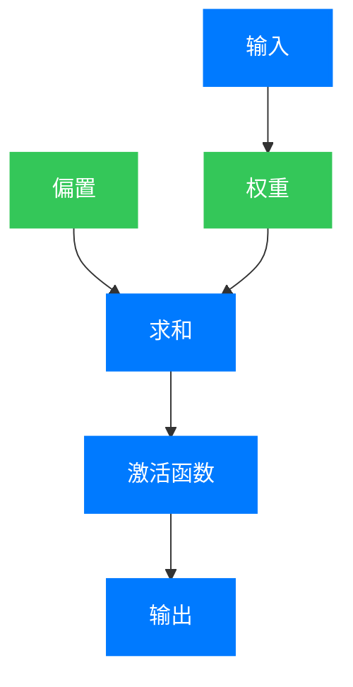
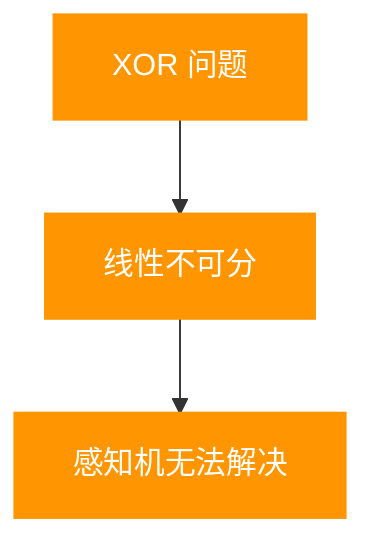

## 引言：人工智能的原点

在人工智能的发展历程中，感知机（Perceptron）是一个具有里程碑意义的概念。它不仅是最早的机器学习算法之一，也是现代深度学习和神经网络的基础。

感知机的故事开始于 20 世纪中叶，当时计算机科学刚刚萌芽，科学家们开始探索如何让机器具备"学习"的能力。

## 第一章：感知机的诞生背景

### 1.1 早期人工智能研究的梦想

20 世纪 40 年代末到 50 年代初，随着计算机的诞生，科学家们开始思考：机器能否像人一样思考和学习？

- **图灵测试**：1950 年，艾伦·图灵提出了著名的图灵测试，为人工智能的发展奠定了理论基础。
- **神经网络的早期构想**：1943 年，麦卡洛克和皮茨提出了第一个人工神经网络模型，称为麦卡洛克-皮茨神经元。

### 1.2 罗森布拉特的突破

1957 年，美国心理学家弗兰克·罗森布拉特（Frank Rosenblatt）在康奈尔航空实验室提出了感知机模型。他将感知机描述为"能够通过经验自动学习的机器"。

罗森布拉特的工作受到了神经科学的启发，他试图模拟人类大脑中神经元的工作方式。

## 第二章：感知机的核心原理

### 2.1 感知机的基本结构

感知机是一个简单的线性分类器，它的结构非常简单：

### 2.2 感知机的工作原理

感知机的工作原理可以用以下公式表示：

$$
y = \begin{cases}
1, & \text{if } w \cdot x + b \geq 0 \\
0, & \text{otherwise}
\end{cases}
$$

其中：
- $x$ 是输入向量
- $w$ 是权重向量
- $b$ 是偏置
- $\cdot$ 表示点积

### 2.3 感知机的学习算法

罗森布拉特还提出了感知机的学习算法，通过调整权重和偏置来实现分类：

1. 初始化权重和偏置
2. 对于每个训练样本，计算输出
3. 根据错误调整权重和偏置
4. 重复步骤 2-3，直到收敛

## 第三章：感知机的发展历程

### 3.1 早期的成功与 hype

在感知机提出后的几年里，罗森布拉特和他的团队进行了一系列实验，包括使用感知机识别手写数字和简单的图像。

1960 年，《纽约时报》甚至发表了一篇文章，标题为"一台电子计算机能够自学：康奈尔大学展示的设备能够识别字母和数字"。

### 3.2 局限性的发现

1969 年，马文·明斯基（Marvin Minsky）和西摩尔·帕普特（Seymour Papert）出版了《感知机》（Perceptrons）一书，指出了感知机的局限性。

他们证明了感知机无法解决非线性分类问题，最著名的例子是异或（XOR）问题：

### 3.3 人工智能寒冬

《感知机》一书的出版对人工智能研究产生了深远的影响。许多研究机构和政府机构减少了对神经网络研究的资助，人工智能进入了"寒冬"时期。

### 3.4 突破与复兴

20 世纪 80 年代，随着计算能力的提高和新的算法的提出，神经网络研究开始复兴：

- **多层感知机**：通过堆叠多个感知机构成多层网络
- **反向传播算法**：用于训练深层神经网络
- **ReLU 激活函数**：解决了梯度消失问题

### 3.5 深度学习的崛起

21 世纪初，随着大数据和 GPU 的普及，深度学习开始崛起：

- **卷积神经网络（CNN）**：用于图像处理
- **循环神经网络（RNN）**：用于序列数据处理
- **Transformer**：用于自然语言处理

## 第四章：感知机的现代应用

### 4.1 图像识别

感知机的原理被应用于图像识别系统，包括：

- 手写数字识别
- 人脸识别
- 物体检测

### 4.2 自然语言处理

感知机的概念被扩展到自然语言处理领域：

- 文本分类
- 情感分析
- 机器翻译

### 4.3 医疗诊断

感知机和神经网络被用于医疗诊断：

- 疾病预测
- 影像分析
- 药物发现

## 第五章：感知机的影响与意义

### 5.1 理论意义

感知机的提出为机器学习和人工智能的发展奠定了基础：

- 它是第一个可以自动学习的算法
- 它引入了权重调整和监督学习的概念
- 它为后来的神经网络研究提供了基础

### 5.2 实践意义

感知机的原理在现代人工智能系统中得到了广泛应用：

- 所有的深度学习模型都是基于感知机的扩展
- 感知机的学习算法是现代优化方法的基础
- 感知机的思想影响了整个机器学习领域

## 结语：感知机的未来

感知机从诞生到现在已经有了近 70 年的历史。虽然它本身是一个简单的线性分类器，但它的思想和原理对人工智能的发展产生了深远的影响。

随着计算能力的不断提高和新算法的不断提出，感知机的原理将继续在人工智能领域发挥重要作用。从简单的线性分类到复杂的深度学习系统，感知机的演变历程展示了人类对智能的不断探索和追求。

正如罗森布拉特在 1958 年所写的那样："感知机不仅是一种工具，更是一种思考方式。"

---

**参考文献**：
1. Rosenblatt, F. (1958). The Perceptron: A Probabilistic Model for Information Storage and Organization in the Brain. Psychological Review, 65(6), 386-408.
2. Minsky, M., & Papert, S. (1969). Perceptrons: An Introduction to Computational Geometry. MIT Press.
3. Rumelhart, D. E., Hinton, G. E., & Williams, R. J. (1986). Learning representations by back-propagating errors. Nature, 323(6088), 533-536.
