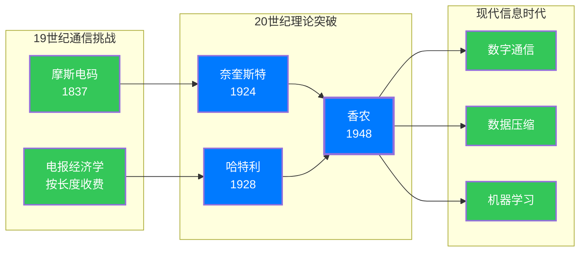
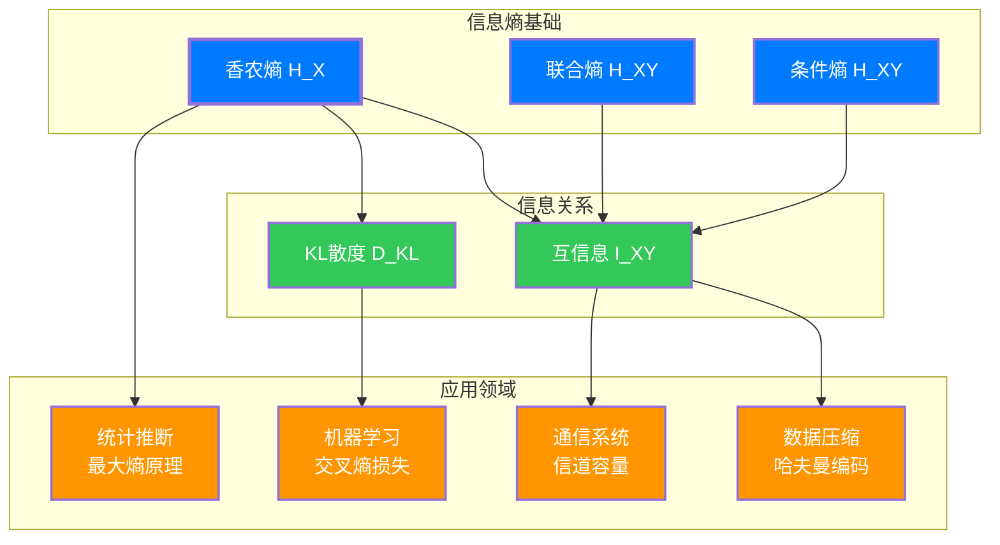

## 引言：一条电报引发的思考

### 信息是什么？

1844年5月24日，萨缪尔·摩斯（Samuel Morse）从华盛顿向巴尔的摩发出了人类历史上第一条电报：

> "What hath God wrought!"

这四个单词穿越了64公里的铜线，开启了电信时代。但在庆祝之余，一个问题逐渐浮现：**这条消息究竟包含了多少"信息"？**

这个问题看似简单，实则深奥。"信息"是一个抽象的概念，如何用数学来量化它？一封情书和一份天气预报，哪一份包含更多"信息"？一条加密后的消息和原始消息，信息量是否相同？

这些问题的答案，隐藏在一位贝尔实验室工程师的伟大发现中。

### 香农的登场

1948年，克劳德·香农（Claude Shannon）发表了题为《通信的数学理论》的论文。这篇32页的论文，被誉为"数字时代的创世大宪章"。

在论文中，香农给出了"信息"的精确定义，并引入了一个核心概念——**信息熵**。这个名字借用了热力学中的"熵"，暗示了两者之间深刻的联系。

本文将带你踏上一段历史与数学交织的旅程，从电报时代的实际问题出发，逐步揭示信息熵的诞生、内涵及其深远影响。

---

## 第一章：信息时代的黎明——通信效率的困惑

### 1.1 摩斯电码中的智慧

在香农之前，通信工程师们已经面临着一个实际问题：**如何用最少的符号传输最多的信息？**

摩斯电码给出了一个直观的答案。观察摩斯电码的设计：

```
E: .          (最常用)
T: -          (第二常用)
A: .-
Q: --.-       (很少使用)
Z: --..
```

摩斯天才地意识到：**常用的字母应该用较短的编码，不常用的字母可以用较长的编码**。这个设计原则在今天看来理所当然，但在当时是革命性的。

但这引发了更深层的思考：如何精确衡量一个字母的"常用程度"？如何计算整个编码系统的效率？这些问题需要数学语言的精确描述。

### 1.2 电报的经济学问题

19世纪的电报按字收费，一条消息的成本与其长度直接相关。因此，**压缩信息**不仅是技术问题，更是经济问题。

工程师们开始思考：
- 如果我们能知道每个字母出现的概率，能否设计出最优的编码？
- 通信线路的"容量"有没有理论极限？
- 噪声（干扰）对信息传输的影响有多大？

这些问题的答案，要等到20世纪才逐渐浮现。



---

## 第二章：先驱的脚步——奈奎斯特与哈特利

### 2.1 奈奎斯特的发现

1924年，贝尔实验室的哈里·奈奎斯特（Harry Nyquist）在研究电报传输时，做出了一个重要发现。

他认识到：** telegraph 信号的传输速率与信号的带宽成正比**。用数学语言表达：

$$W = K \cdot B$$

其中 $W$ 是传输速率，$B$ 是带宽，$K$ 是一个常数。

这是人类第一次用数学公式描述通信系统的"能力"。

### 2.2 哈特利的推广

1928年，拉尔夫·哈特利（Ralph Hartley）进一步推广了奈奎斯特的工作。他意识到，信息量不仅与信号的数目有关，还与这些信号出现的**概率**有关。

哈特利提出了一个重要的观察：如果有 $M$ 个可能的符号，每个符号携带的信息量应该是：

$$I = \log_2 M$$

这里的对数形式至关重要——它反映了信息的**可加性**：如果我们将两个独立的消息组合，总信息量应该是各自信息量之和。

**为什么是对数？**

假设你有两套独立的符号系统，分别有 $M$ 和 $N$ 个符号。组合后共有 $MN$ 种可能：

$$\log_2(MN) = \log_2 M + \log_2 N$$

这种可加性正是信息应有的特性！

### 2.3 哈特利公式的局限

哈特利公式 $I = \log_2 M$ 有一个隐含假设：**所有符号出现的概率相等**。

但现实并非如此。在英语中，'e' 出现的概率远高于 'z'；在天气预报中，"晴天"的概率可能高于"暴风雨"。

哈特利不知道如何处理不等概率的情况，这个难题留给了香农。

---

## 第三章：香农的突破——信息熵的诞生

### 3.1 1948年的伟大论文

1948年，香农在《贝尔系统技术杂志》上发表了《通信的数学理论》。这篇论文的开头就明确了目标：

> "The fundamental problem of communication is that of reproducing at one point either exactly or approximately a message selected at another point."
>
> "通信的根本问题，是在一点精确或近似地重现另一点所选出的消息。"

香农的伟大之处在于：他将"信息"从其具体内容中抽离出来，只关注其**统计特性**。

### 3.2 信息量的直觉定义

香农首先思考：**什么是一个合理的信息量度量？**

他提出了几个直观要求：

1. **连续性**：概率的微小变化应导致信息量的微小变化
2. **单调性**：事件发生的概率越小，得知它发生时获得的信息量越大
3. **可加性**：两个独立事件同时发生的信息量，应该是各自信息量之和

根据这些要求，香农得出：如果一个事件发生的概率是 $p$，那么观察到这个事件所获得的信息量应该是：

$$I(p) = -\log_2 p$$

**负号的意义**：由于 $0 \leq p \leq 1$，$\log_2 p \leq 0$，加上负号使信息量为正值。

**直观解释**：
- 如果 $p = 1$（必然事件），$I = 0$——告诉你明天太阳会升起，信息量为零
- 如果 $p = 0.5$（抛硬币），$I = 1$ 比特
- 如果 $p = 0.125$（从8个中选1个），$I = 3$ 比特

### 3.3 信息熵的定义

现在考虑一个随机变量 $X$，它可以取 $n$ 个不同的值 $\{x_1, x_2, \dots, x_n\}$，对应的概率是 $\{p_1, p_2, \dots, p_n\}$。

**每个可能取值的信息量**是 $I(x_i) = -\log_2 p_i$。

**平均信息量**（即信息熵）是：

$$H(X) = \sum_{i=1}^{n} p_i \cdot I(x_i) = -\sum_{i=1}^{n} p_i \log_2 p_i$$

这就是**香农熵**的定义！

**符号的选择**：香农选择符号 $H$ 来表示熵，是为了向玻尔兹曼（Boltzmann）的热力学熵致敬。

---

## 第四章：深入理解信息熵

### 4.1 一个直观例子

假设有一个天气预报系统，每天预报三种天气：晴天、阴天、雨天。

**情况A：概率均等**
- 晴天：$p = 1/3$
- 阴天：$p = 1/3$
- 雨天：$p = 1/3$

$$H = -\left(\frac{1}{3}\log_2\frac{1}{3} + \frac{1}{3}\log_2\frac{1}{3} + \frac{1}{3}\log_2\frac{1}{3}\right) = \log_2 3 \approx 1.58 \text{ 比特}$$

**情况B：沙漠地区**
- 晴天：$p = 0.9$
- 阴天：$p = 0.09$
- 雨天：$p = 0.01$

$$H = -(0.9\log_2 0.9 + 0.09\log_2 0.09 + 0.01\log_2 0.01) \approx 0.52 \text{ 比特}$$

**情况C：确定性系统**
- 晴天：$p = 1$
- 阴天：$p = 0$
- 雨天：$p = 0$

$$H = 0 \text{ 比特}$$

**结论**：熵衡量的是**不确定性**。概率分布越均匀，熵越大；分布越集中，熵越小；完全确定时，熵为零。

### 4.2 熵的数学性质

香农证明了信息熵具有以下重要性质：

**性质1：非负性**
$$H(X) \geq 0$$

**性质2：最大值**
对于 $n$ 个可能的结果，熵的最大值是 $\log_2 n$，当所有概率相等时达到。

**性质3：凸性**
熵是概率分布的凹函数，这意味着混合概率分布的熵不低于各分布熵的加权平均。

### 4.3 与热力学熵的联系

香农最初想称这个量为"信息"，但冯·诺依曼（John von Neumann）建议：

> "You should call it entropy, for two reasons. In the first place your uncertainty function has been used in statistical mechanics under that name, so it already has a name. In the second place, and more important, no one knows what entropy really is, so in a debate you will always have the advantage."
>
> "你应该称它为熵，有两个原因。第一，你的不确定性函数在统计力学中已经用这个名字了。第二，也是更重要的，没有人真正知道熵是什么，所以在辩论中你总是占优势。"

事实上，两者的联系确实深刻。热力学熵的玻尔兹曼公式：

$$S = k_B \ln W$$

其中 $W$ 是微观状态数，$k_B$ 是玻尔兹曼常数。

如果将微观状态视为等概率的，香农熵与热力学熵本质上相同，只是单位不同。

### 4.4 连续变量的熵：微分熵

对于连续随机变量，我们将求和替换为积分：

$$h(X) = -\int_{-\infty}^{\infty} f(x) \log_2 f(x) \, dx$$

其中 $f(x)$ 是概率密度函数。

这称为**微分熵**。需要注意的是，微分熵可以为负值，因为连续变量的信息量与坐标选择有关。

---

## 第五章：信息熵的家族——相关概念

### 5.1 联合熵

两个随机变量 $X$ 和 $Y$ 的联合熵定义为：

$$H(X, Y) = -\sum_{x, y} p(x, y) \log_2 p(x, y)$$

这衡量了两个变量一起包含的不确定性。

**重要性质**：
$$H(X, Y) \leq H(X) + H(Y)$$

等号成立当且仅当 $X$ 和 $Y$ 相互独立。这意味着：**变量之间的相关性减少了总的不确定性**。

### 5.2 条件熵

已知 $Y$ 的情况下，$X$ 的条件熵：

$$H(X|Y) = -\sum_{x, y} p(x, y) \log_2 p(x|y)$$

这表示"在知道 $Y$ 之后，$X$ 还剩下多少不确定性"。

**链式法则**：
$$H(X, Y) = H(Y) + H(X|Y)$$

这个公式非常直观：要了解 $X$ 和 $Y$ 的全部信息，可以先了解 $Y$，然后了解在已知 $Y$ 的情况下 $X$ 的额外信息。

### 5.3 互信息

$X$ 和 $Y$ 之间的互信息定义为：

$$I(X; Y) = H(X) - H(X|Y) = H(Y) - H(Y|X)$$

或者等价地：

$$I(X; Y) = \sum_{x, y} p(x, y) \log_2 \frac{p(x, y)}{p(x)p(y)}$$

**直观含义**：互信息衡量的是两个变量之间**共享**的信息量。

**性质**：
- $I(X; Y) \geq 0$
- $I(X; Y) = 0$ 当且仅当 $X$ 和 $Y$ 独立
- $I(X; Y) = I(Y; X)$（对称性）

### 5.4 KL散度（相对熵）

Kullback-Leibler 散度衡量两个概率分布 $P$ 和 $Q$ 之间的差异：

$$D_{KL}(P \| Q) = \sum_{x} P(x) \log_2 \frac{P(x)}{Q(x)}$$

**重要性质**：
- $D_{KL}(P \| Q) \geq 0$
- $D_{KL}(P \| Q) = 0$ 当且仅当 $P = Q$
- $D_{KL}$ 不是距离（不对称，不满足三角不等式）

KL散度在机器学习中极其重要，它是许多算法的核心。

### 5.5 交叉熵

交叉熵定义为：

$$H(P, Q) = -\sum_{x} P(x) \log_2 Q(x)$$

它与KL散度的关系：

$$H(P, Q) = H(P) + D_{KL}(P \| Q)$$

**机器学习中的应用**：在分类问题中，我们最小化交叉熵损失，实际上是在最小化预测分布与真实分布之间的KL散度（因为 $H(P)$ 是常数）。



---

## 第六章：从理论到应用——信息熵的广泛影响

### 6.1 信源编码定理

香农的第一定理，也称为**无失真信源编码定理**，给出了数据压缩的理论极限：

> 一个熵为 $H$ 的信源，无法以低于 $H$ 比特/符号的速率进行无损编码；但可以任意接近 $H$。

这个定理告诉我们：
- ZIP、GZIP 等压缩算法的极限是什么
- 为什么有些文件无法被压缩
- 哈夫曼编码为什么是最优的前缀编码

### 6.2 信道编码定理

香农的第二定理，**有噪信道编码定理**，解决了通信的根本问题：

> 任何通信信道都有确定的"容量" $C$。只要传输速率低于 $C$，就存在编码方式使错误率任意接近零。

这个定理的革命性在于：它告诉我们**可靠的通信是可能的**，即使在有噪声的信道上！

在此之前，人们认为减少错误的唯一方法是提高信号功率或降低传输速率。香农证明，通过巧妙的编码，我们可以在不增加功率的情况下实现可靠通信。

### 6.3 最大熵原理

在统计推断中，**最大熵原理**提供了一种选择概率分布的方法：

> 在所有与已知约束条件兼容的概率分布中，应该选择熵最大的那个。

这个原理的直觉是：**不要添加没有根据的信息**。

例如，如果你只知道一个分布的均值和方差，最大熵原理会告诉你选择高斯分布——因为这是在满足这些约束下最"无偏"的分布。

### 6.4 机器学习中的应用

信息熵的概念在现代机器学习中无处不在：

**分类问题**：交叉熵损失是训练神经网络的标准损失函数。

**特征选择**：信息增益（互信息）用于决策树算法选择最佳分割特征。

**生成模型**：变分推断使用KL散度来近似复杂的后验分布。

**强化学习**：熵正则化鼓励探索，防止策略过早收敛。

---

## 第七章：信息熵的计算实例

### 7.1 抛硬币的熵

**公平硬币**：$p(\text{正面}) = p(\text{反面}) = 0.5$

$$H = -(0.5 \log_2 0.5 + 0.5 \log_2 0.5) = 1 \text{ 比特}$$

**不公平硬币**：$p(\text{正面}) = 0.9$, $p(\text{反面}) = 0.1$

$$H = -(0.9 \log_2 0.9 + 0.1 \log_2 0.1) \approx 0.47 \text{ 比特}$$

不公平硬币的熵更小，因为结果更可预测。

### 7.2 英文字母的熵

如果我们统计英语文本中26个字母的出现频率，可以计算英语的"一阶熵"：

$$H_1 \approx 4.07 \text{ 比特/字母}$$

但考虑到字母之间的关联（如 'q' 后面几乎总是 'u'），实际熵更低：

$$H_0 = \log_2 26 \approx 4.75 \text{ 比特/字母}$$
$$H_1 \approx 4.07 \text{ 比特/字母}$$
$$H_2 \approx 3.5 \text{ 比特/字母}$$（二阶近似）

实际英语的熵大约是 **1-1.5 比特/字母**（考虑长距离关联）。

### 7.3 DNA序列的熵

DNA由四个碱基组成：A、T、G、C。在不同物种和基因组区域中，碱基分布不同：

**人类基因组**：A/T/G/C 约为 30%/30%/20%/20%
$$H \approx 1.97 \text{ 比特/碱基}$$

**某些细菌**：分布更均匀
$$H \approx 2.0 \text{ 比特/碱基}$$

熵的计算可以帮助识别基因编码区和非编码区，因为它们有不同的统计特性。

---

## 结语：香农的遗产

### 从比特到宇宙

1948年，香农在贝尔实验室的一间小屋里，用数学公式刻画了"信息"的本质。这个看似抽象的概念，后来成为了数字时代的基石。

今天，香农熵的应用远远超出了通信工程：

- **物理学**：量子信息论将熵与量子纠缠联系起来
- **生物学**：DNA序列分析、蛋白质结构预测
- **计算机科学**：算法分析、数据结构、密码学
- **经济学**：金融市场分析、风险管理
- **哲学**：意识的度量、信息的本体论地位

### 信息的哲学

香农最重要的洞察或许是：**信息是可以从意义中分离出来的**。

从摩斯的"电报信息量"到今天的"数据流量"，我们衡量的是符号的不确定性，而不是它们的语义。这种"语义无关性"恰恰是现代数字技术的基础——你的手机用相同的方式处理情书和银行账单，因为它不关心"意义"，只关心"模式"。

但这提出了更深的问题：信息与意义是什么关系？一条消息可以携带大量信息却毫无意义吗？大脑处理的是信息还是意义？

这些问题仍在探索中，而香农熵为我们提供了精确的语言来讨论它们。

### 展望未来

随着量子计算的发展，量子信息论正在拓展我们对熵的理解。量子纠缠带来的新型相关性，产生了经典理论无法解释的现象。

同时，在人工智能领域，信息几何、互信息神经网络等新方向正在兴起。香农的熵，这个诞生于电报时代的概念，仍在引领着技术的未来。

---

## 参考文献与延伸阅读

1. Shannon, C. E. (1948). "A Mathematical Theory of Communication". *Bell System Technical Journal*, 27, 379-423, 623-656.
2. Cover, T. M., & Thomas, J. A. (2006). *Elements of Information Theory* (2nd ed.). Wiley.
3. Pierce, J. R. (1980). *An Introduction to Information Theory: Symbols, Signals and Noise*. Dover.
4. Gleick, J. (2011). *The Information: A History, a Theory, a Flood*. Pantheon.

---

*香农曾说："信息就是信息，不是物质，也不是能量。"在这个数据驱动的时代，理解信息的本质，或许是我们理解世界本质的关键一步。*
