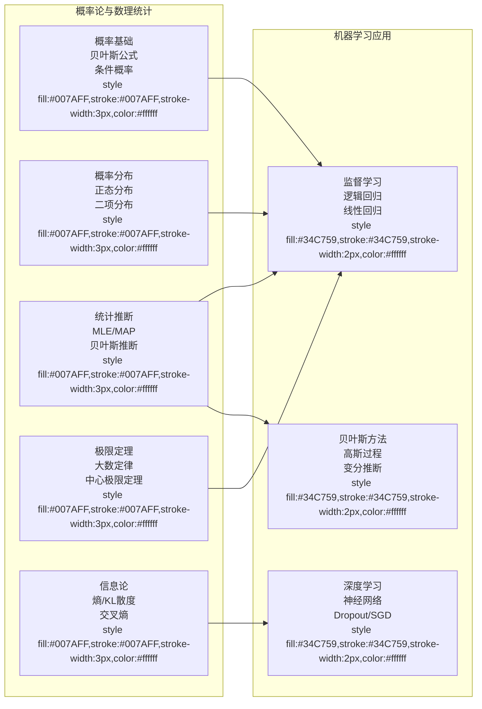

# 概率论与数理统计在机器学习中的应用

## 引言

想象一下，你站在一个赌场的轮盘赌桌前。小球在旋转的轮盘上跳跃，最终停在一个数字上。你知道这个结果是完全随机的吗？还是说，如果你能足够精确地测量小球的初始位置、速度、轮盘的摩擦系数等所有参数，你就能预测出最终的结果？

这个思想实验引发了人类对概率本质的思考。17世纪，法国数学家帕斯卡和费马在通信中讨论了赌博问题，标志着概率论作为一门数学学科的诞生。随后的几个世纪里，伯努利、拉普拉斯、高斯等数学大师们为概率论的发展做出了巨大贡献。

到了20世纪初，俄罗斯数学家柯尔莫哥洛夫给出了概率论的严格公理化定义，将概率论建立在坚实的数学基础之上。几乎同时，贝叶斯的理论开始重新受到重视，为我们提供了一种全新的思考不确定性的方式。

那么，概率论和机器学习有什么关系呢？让我们来看一个生活中的例子。

假设你是一名医生，你需要根据患者的症状来诊断疾病。你有体温、血压、血常规等数据，以及过去的诊断记录。你会怎么做？你会综合考虑所有因素，得出一个诊断结论。这个过程本质上就是一个概率推断过程——根据观测到的数据（症状），推断最可能的原因（疾病）。

机器学习也是如此。给定一堆数据，模型需要学习数据背后的规律，然后对新的数据进行预测。在这个过程中，不确定性无处不在：数据可能有噪声，模型可能不完美，预测结果也可能有偏差。概率论为我们提供了处理这些不确定性的数学工具。

在这篇文章中，我们将系统地介绍概率论与数理统计在机器学习中的应用。我们将从基础的概率公理开始，逐步深入到极限定理、统计推断、信息论基础，最后探讨这些理论如何在现代机器学习和深度学习算法中发挥作用。

## 第一章：概率基础

### 1.1 概率的公理化定义

1933年，柯尔莫哥洛夫建立了现代概率论的基础。他提出了三条基本公理：

**公理1（非负性）**：对于任何事件 $A$，都有 $P(A) \geq 0$。

**公理2（规范性）**：样本空间 $\Omega$ 的概率为 1，即 $P(\Omega) = 1$。

**公理3（可加性）**：对于任意可数个互斥事件 $A_1, A_2, \ldots$，有
$$P\left(\bigcup_{i=1}^{\infty} A_i\right) = \sum_{i=1}^{\infty} P(A_i)$$

这三条公理看起来很简单，但它们是整个概率论大厦的基石。从这些公理出发，我们可以推导出概率论的所有重要结果。

例如，对于两个事件 $A$ 和 $B$，我们可以推导出并集的概率公式：
$$P(A \cup B) = P(A) + P(B) - P(A \cap B)$$

这个公式的直观理解是：将 $A$ 的概率和 $B$ 的概率相加时，$A$ 和 $B$ 的交集部分被计算了两次，所以需要减去一次。

### 1.2 条件概率和独立性

条件概率是概率论中最重要的概念之一。直观地说，条件概率 $P(A|B)$ 表示"在事件 $B$ 已经发生的条件下，事件 $A$ 发生的概率"。

数学上，条件概率的定义是：
$$P(A|B) = \frac{P(A \cap B)}{P(B)}$$

其中 $P(B) > 0$。

**例子**：假设一个口袋里有 3 个红球和 2 个白球。从中随机取出一个球，不放回，再取出一个球。问：第一次取到红球的条件下，第二次也取到红球的概率是多少？

解：设 $A$ 为"第一次取到红球"，$B$ 为"第二次取到红球"。
- $P(A) = \frac{3}{5}$
- $P(A \cap B) = \frac{3}{5} \times \frac{2}{4} = \frac{6}{20} = \frac{3}{10}$

因此，$P(B|A) = \frac{P(A \cap B)}{P(A)} = \frac{3/10}{3/5} = \frac{1}{2}$

这符合直觉：第一次取走一个红球后，袋子里还剩下 2 个红球和 2 个白球，所以第二次取到红球的概率是 $\frac{2}{4} = \frac{1}{2}$。

**独立性**是条件概率的一个重要特例。两个事件 $A$ 和 $B$ 是独立的，当且仅当：
$$P(A \cap B) = P(A) \cdot P(B)$$

或者说，$P(A|B) = P(A)$，即 $B$ 的发生不影响 $A$ 发生的概率。

**例子**：抛两次硬币，第一次正面向上（$A$）和第二次正面向上（$B$）是独立事件，因为第一次的结果不会影响第二次的结果。

### 1.3 全概率公式和贝叶斯公式

全概率公式和贝叶斯公式是概率论中最实用的两个公式，它们在机器学习中有广泛的应用。

**全概率公式**：设 $B_1, B_2, \ldots, B_n$ 是样本空间 $\Omega$ 的一个划分，即它们互不相交且并集为 $\Omega$。那么对于任何事件 $A$，有：
$$P(A) = \sum_{i=1}^{n} P(A|B_i) \cdot P(B_i)$$

这个公式的直观理解是：事件 $A$ 可以以不同的方式发生，每种方式对应于 $A$ 与某个 $B_i$ 同时发生。因此，$A$ 的概率就是所有可能情况的概率之和。

**贝叶斯公式**：从条件概率的定义出发，我们可以推导出贝叶斯公式：
$$P(B_i|A) = \frac{P(A|B_i) \cdot P(B_i)}{P(A)}$$

结合全概率公式，这可以写成：
$$P(B_i|A) = \frac{P(A|B_i) \cdot P(B_i)}{\sum_{j=1}^{n} P(A|B_j) \cdot P(B_j)}$$

贝叶斯公式在机器学习中的重要性怎么强调都不为过。它告诉我们：当我们观察到数据 $A$ 时，应该如何更新我们对假设 $B_i$ 的信念。

让我们用一个医疗诊断的例子来说明贝叶斯公式的应用。

**例子**：某种疾病在人群中的患病率是 1%。一种检测方法能够正确识别 99% 的患病者（真阳性率），但也有 1% 的误报率（假阳性率）。如果一个人的检测结果为阳性，他真正患病的概率是多少？

解：设 $D$ 为"患病"，$T$ 为"检测结果为阳性"。
- $P(D) = 0.01$（先验概率）
- $P(\neg D) = 0.99$
- $P(T|D) = 0.99$（似然）
- $P(T|\neg D) = 0.01$（似然）

我们要求的是 $P(D|T)$（后验概率）：
$$
\begin{aligned}
P(D|T) &= \frac{P(T|D) \cdot P(D)}{P(T|D) \cdot P(D) + P(T|\neg D) \cdot P(\neg D)} \\
&= \frac{0.99 \times 0.01}{0.99 \times 0.01 + 0.01 \times 0.99} \\
&= \frac{0.0099}{0.0099 + 0.0099} \\
&= 0.5
\end{aligned}
$$

这是一个令人惊讶的结果：即使检测方法的准确率达到 99%，阳性检测结果也只有 50% 的概率真正患病！这个例子说明了贝叶斯公式的重要性：我们不能只看检测方法的准确性，还要考虑基础患病率（先验概率）。

在机器学习中，这种思维方式无处不在。当我们训练一个模型时，我们实际上是在利用数据来更新我们对模型参数的信念。

## 第二章：随机变量和概率分布

### 2.1 随机变量的定义

随机变量是概率论中最重要的概念之一。直观地说，随机变量是一个将样本空间映射到实数的函数。

**定义**：设 $(\Omega, \mathcal{F}, P)$ 是一个概率空间，随机变量 $X$ 是一个从 $\Omega$ 到 $\mathbb{R}$ 的可测函数：
$$X: \Omega \rightarrow \mathbb{R}$$

随机变量可以分为两类：
- **离散型随机变量**：取值为有限或可数个
- **连续型随机变量**：取值在某个区间或整个实数轴上

### 2.2 离散型概率分布

#### 2.2.1 伯努利分布

伯努利分布是最简单的离散型分布，描述的是单次试验的结果（成功或失败）。

**概率质量函数（PMF）**：
$$P(X = x) = p^x (1-p)^{1-x}, \quad x \in \{0, 1\}$$

其中 $p$ 是成功的概率。

**期望和方差**：
$$E[X] = p$$
$$\text{Var}(X) = p(1-p)$$

**应用**：机器学习中的二分类问题，如垃圾邮件检测（垃圾邮件或非垃圾邮件）。

#### 2.2.2 二项分布

二项分布描述的是 $n$ 次独立的伯努利试验中成功的次数。

**概率质量函数**：
$$P(X = k) = \binom{n}{k} p^k (1-p)^{n-k}, \quad k = 0, 1, \ldots, n$$

其中 $\binom{n}{k} = \frac{n!}{k!(n-k)!}$ 是二项式系数。

**期望和方差**：
$$E[X] = np$$
$$\text{Var}(X) = np(1-p)$$

**推导**：设 $X_i$ 为第 $i$ 次试验的伯努利随机变量，则 $X = \sum_{i=1}^{n} X_i$。由于期望和方差都具有线性性质，有：
$$
\begin{aligned}
E[X] &= E\left[\sum_{i=1}^{n} X_i\right] = \sum_{i=1}^{n} E[X_i] = np \\
\text{Var}(X) &= \text{Var}\left(\sum_{i=1}^{n} X_i\right) = \sum_{i=1}^{n} \text{Var}(X_i) = np(1-p)
\end{aligned}
$$

**应用**：模型预测的准确率统计（例如，在 100 个测试样本中预测对了多少个）。


#### 2.2.3 泊松分布

泊松分布描述的是在固定时间或空间内某事件发生的次数，当事件以固定的平均速率随机发生且相互独立时。

**概率质量函数**：
$$P(X = k) = \frac{e^{-\lambda} \lambda^k}{k!}, \quad k = 0, 1, 2, \ldots$$

其中 $\lambda$ 是单位时间或空间内事件发生的平均次数。

**期望和方差**：
$$E[X] = \lambda$$
$$\text{Var}(X) = \lambda$$

**应用**：稀有事件的建模，如网络中的请求到达、缺陷检测等。


### 2.3 连续型概率分布

#### 2.3.1 正态分布

正态分布（高斯分布）是概率论中最重要的分布，也是机器学习中最常用的分布。

**概率密度函数（PDF）**：
$$f(x) = \frac{1}{\sqrt{2\pi}\sigma} \exp\left(-\frac{(x-\mu)^2}{2\sigma^2}\right)$$

其中 $\mu$ 是均值，$\sigma^2$ 是方差。

**期望和方差**：
$$E[X] = \mu$$
$$\text{Var}(X) = \sigma^2$$

**标准化**：如果 $X \sim \mathcal{N}(\mu, \sigma^2)$，则 $Z = \frac{X-\mu}{\sigma} \sim \mathcal{N}(0, 1)$，即标准正态分布。

**推导**：让我们验证标准化后的随机变量 $Z$ 的期望为 0，方差为 1。
$$
\begin{aligned}
E[Z] &= E\left[\frac{X-\mu}{\sigma}\right] = \frac{E[X] - \mu}{\sigma} = \frac{\mu - \mu}{\sigma} = 0 \\
\text{Var}(Z) &= \text{Var}\left(\frac{X-\mu}{\sigma}\right) = \frac{\text{Var}(X)}{\sigma^2} = \frac{\sigma^2}{\sigma^2} = 1
\end{aligned}
$$

**应用**：高斯过程回归、误差模型、神经网络的权重初始化等。


#### 2.3.2 多元正态分布

多元正态分布是正态分布的推广，描述多个相关的随机变量的联合分布。

**概率密度函数**：
$$f(\mathbf{x}) = \frac{1}{(2\pi)^{d/2} |\boldsymbol{\Sigma}|^{1/2}} \exp\left(-\frac{1}{2} (\mathbf{x} - \boldsymbol{\mu})^\top \boldsymbol{\Sigma}^{-1} (\mathbf{x} - \boldsymbol{\mu})\right)$$

其中：
- $\mathbf{x} \in \mathbb{R}^d$ 是随机向量
- $\boldsymbol{\mu} \in \mathbb{R}^d$ 是均值向量
- $\boldsymbol{\Sigma} \in \mathbb{R}^{d \times d}$ 是协方差矩阵（正定矩阵）

**期望和协方差**：
$$E[\mathbf{X}] = \boldsymbol{\mu}$$
$$\text{Cov}(\mathbf{X}) = \boldsymbol{\Sigma}$$

**应用**：高斯过程、线性模型、贝叶斯线性回归等。

### 2.4 期望、方差和协方差

#### 2.4.1 数学期望

数学期望是随机变量的"平均值"，反映了随机变量的集中趋势。

**离散型**：
$$E[X] = \sum_{x} x \cdot P(X = x)$$

**连续型**：
$$E[X] = \int_{-\infty}^{\infty} x \cdot f(x) \, dx$$

**性质**：
1. $E[aX + b] = a E[X] + b$（线性性质）
2. $E[X + Y] = E[X] + E[Y]$
3. 如果 $X$ 和 $Y$ 独立，则 $E[XY] = E[X] E[Y]$

#### 2.4.2 方差

方差衡量随机变量与其期望的偏离程度。

**定义**：
$$\text{Var}(X) = E[(X - E[X])^2] = E[X^2] - (E[X])^2$$

**性质**：
1. $\text{Var}(aX + b) = a^2 \text{Var}(X)$
2. 如果 $X$ 和 $Y$ 独立，则 $\text{Var}(X + Y) = \text{Var}(X) + \text{Var}(Y)$
3. 一般情况下，$\text{Var}(X + Y) = \text{Var}(X) + \text{Var}(Y) + 2 \cdot \text{Cov}(X, Y)$

#### 2.4.3 协方差和相关系数

协方差衡量两个随机变量的线性关系。

**定义**：
$$\text{Cov}(X, Y) = E[(X - E[X])(Y - E[Y])] = E[XY] - E[X]E[Y]$$

**相关系数**：
$$\rho_{X,Y} = \frac{\text{Cov}(X, Y)}{\sqrt{\text{Var}(X) \text{Var}(Y)}}$$

相关系数的取值范围是 $[-1, 1]$：
- $\rho = 1$：完全正相关
- $\rho = -1$：完全负相关
- $\rho = 0$：无线性相关（但可能有非线性关系）

**应用**：特征相关性分析、协方差矩阵的逆在贝叶斯线性回归中的作用等。

## 第三章：极限定理

### 3.1 大数定律

大数定律描述了大量重复试验的平均结果会趋近于期望值。

#### 3.1.1 弱大数定律

设 $X_1, X_2, \ldots, X_n$ 是独立同分布（i.i.d.）的随机变量，且 $E[X_i] = \mu$ 存在有限。那么对于任意 $\epsilon > 0$：
$$\lim_{n \to \infty} P\left(\left|\frac{1}{n}\sum_{i=1}^{n} X_i - \mu\right| \geq \epsilon\right) = 0$$

**直观理解**：当样本数量足够多时，样本均值会以很高的概率接近总体均值。

**应用**：验证机器学习模型在测试集上的表现是否代表真实性能。如果我们有足够的测试样本，测试准确率应该接近模型的期望准确率。

#### 3.1.2 强大数定律

设 $X_1, X_2, \ldots, X_n$ 是独立同分布的随机变量，且 $E[|X_i|] < \infty$。那么：
$$P\left(\lim_{n \to \infty} \frac{1}{n}\sum_{i=1}^{n} X_i = \mu\right) = 1$$

**直观理解**：样本均值几乎必然收敛于总体均值。

### 3.2 中心极限定理

中心极限定理是概率论中最著名的定理之一，它解释了为什么正态分布在统计学中如此重要。

**定理**：设 $X_1, X_2, \ldots, X_n$ 是独立同分布的随机变量，且 $E[X_i] = \mu$，$\text{Var}(X_i) = \sigma^2$ 存在有限。那么当 $n \to \infty$ 时：
$$\frac{\sum_{i=1}^{n} X_i - n\mu}{\sigma\sqrt{n}} \xrightarrow{d} \mathcal{N}(0, 1)$$

其中 $\xrightarrow{d}$ 表示依分布收敛。

**直观解释**：无论原始分布是什么，只要样本量足够大，样本均值的分布都会趋近于正态分布。

**应用**：在机器学习中，很多算法的误差分布可以假设为正态分布。例如，线性回归的残差通常假设服从正态分布。


**例子**：假设我们有一个分类模型，我们想知道模型在测试集上的准确率。我们可以从测试集中随机采样 100 次，每次采样 100 个样本，计算准确率。根据中心极限定理，这些准确率的分布会近似服从正态分布。

## 第四章：统计推断

### 4.1 参数估计

参数估计是统计推断的核心问题之一：给定数据，如何估计分布的参数？

#### 4.1.1 最大似然估计（MLE）

最大似然估计的基本思想是：找到使观测数据出现概率最大的参数值。

**定义**：设 $X_1, X_2, \ldots, X_n$ 是来自分布 $p(x|\theta)$ 的独立同分布样本，其中 $\theta$ 是未知参数。似然函数定义为：
$$L(\theta) = \prod_{i=1}^{n} p(x_i|\theta)$$

对数似然函数为：
$$\ell(\theta) = \log L(\theta) = \sum_{i=1}^{n} \log p(x_i|\theta)$$

MLE 是使似然函数最大的参数估计：
$$\hat{\theta}_{\text{MLE}} = \arg\max_{\theta} L(\theta) = \arg\max_{\theta} \ell(\theta)$$

**例子：正态分布的 MLE**

设 $X_1, X_2, \ldots, X_n \sim \mathcal{N}(\mu, \sigma^2)$，求 $\mu$ 和 $\sigma^2$ 的 MLE。

对数似然函数为：
$$
\begin{aligned}
\ell(\mu, \sigma^2) &= \sum_{i=1}^{n} \log \left(\frac{1}{\sqrt{2\pi}\sigma} \exp\left(-\frac{(x_i-\mu)^2}{2\sigma^2}\right)\right) \\
&= \sum_{i=1}^{n} \left(-\frac{1}{2}\log(2\pi) - \frac{1}{2}\log(\sigma^2) - \frac{(x_i-\mu)^2}{2\sigma^2}\right) \\
&= -\frac{n}{2}\log(2\pi) - \frac{n}{2}\log(\sigma^2) - \frac{1}{2\sigma^2}\sum_{i=1}^{n} (x_i-\mu)^2
\end{aligned}
$$

对 $\mu$ 求导并令导数为 0：
$$
\begin{aligned}
\frac{\partial \ell}{\partial \mu} &= \frac{1}{\sigma^2} \sum_{i=1}^{n} (x_i - \mu) = 0 \\
\Rightarrow \sum_{i=1}^{n} (x_i - \hat{\mu}) &= 0 \\
\Rightarrow \hat{\mu} &= \frac{1}{n}\sum_{i=1}^{n} x_i
\end{aligned}
$$

对 $\sigma^2$ 求导并令导数为 0：
$$
\begin{aligned}
\frac{\partial \ell}{\partial \sigma^2} &= -\frac{n}{2\sigma^2} + \frac{1}{2(\sigma^2)^2}\sum_{i=1}^{n} (x_i-\mu)^2 = 0 \\
\Rightarrow \frac{1}{\hat{\sigma}^2} &= \frac{1}{n\hat{\sigma}^4}\sum_{i=1}^{n} (x_i-\hat{\mu})^2 \\
\Rightarrow \hat{\sigma}^2 &= \frac{1}{n}\sum_{i=1}^{n} (x_i-\hat{\mu})^2
\end{aligned}
$$

**应用**：逻辑回归、线性回归等监督学习算法本质上都是 MLE 估计。例如，逻辑回归假设 $y_i \mid x_i \sim \text{Bernoulli}(\sigma(w^\top x_i))$，然后通过最大化对数似然来估计参数 $w$。

#### 4.1.2 最大后验估计（MAP）

最大后验估计结合了先验信息，是贝叶斯推断的一种近似。

**贝叶斯公式**：
$$p(\theta|D) = \frac{p(D|\theta) p(\theta)}{p(D)}$$

其中：
- $p(\theta|D)$ 是后验概率（看到数据后的信念）
- $p(D|\theta)$ 是似然（给定参数下数据出现的概率）
- $p(\theta)$ 是先验概率（看到数据前的信念）
- $p(D)$ 是证据（归一化常数）

MAP 估计是使后验概率最大的参数估计：
$$\hat{\theta}_{\text{MAP}} = \arg\max_{\theta} p(\theta|D) = \arg\max_{\theta} p(D|\theta) p(\theta)$$

**MLE 和 MAP 的关系**：如果先验是均匀分布，即 $p(\theta) \propto \text{constant}$，则 MAP 等价于 MLE。因此，MAP 可以看作是 MLE 的推广，它在 MLE 的基础上加入了先验信息。

**例子：带高斯先验的线性回归**

设线性回归模型为 $y = w^\top x + \epsilon$，其中 $\epsilon \sim \mathcal{N}(0, \sigma^2)$。假设参数 $w$ 的先验分布为 $w \sim \mathcal{N}(0, \lambda^{-1} I)$。

似然函数：
$$p(y\mid X, w) = \prod_{i=1}^{n} \mathcal{N}(y_i\mid w^\top x_i, \sigma^2)$$

后验分布：
$$p(w|X, y) \propto p(y|X, w) p(w)$$

取对数：
$$
\begin{aligned}
\log p(w\mid X, y) &\propto \sum_{i=1}^{n} \log \mathcal{N}(y_i\mid w^\top x_i, \sigma^2) + \log \mathcal{N}(w\mid 0, \lambda^{-1} I) \\
&\propto -\frac{1}{2\sigma^2}\sum_{i=1}^{n} (y_i - w^\top x_i)^2 - \frac{\lambda}{2} w^\top w + \text{constant}
\end{aligned}
$$

最大化后验等价于最小化负对数后验：
$$
\begin{aligned}
w_{\text{MAP}} &= \arg\min_{w} \left(\sum_{i=1}^{n} (y_i - w^\top x_i)^2 + \lambda \sigma^2 w^\top w\right) \\
&= \arg\min_{w} \left(\|y - Xw\|^2 + \alpha \|w\|^2\right)
\end{aligned}
$$

其中 $\alpha = \lambda \sigma^2$。

这正是岭回归（Ridge Regression）的目标函数！因此，岭回归可以解释为带高斯先验的线性回归的 MAP 估计。

**应用**：正则化方法本质上都是 MAP 估计。例如：
- L2 正则化（岭回归）$\leftrightarrow$ 高斯先验
- L1 正则化（Lasso）$\leftrightarrow$ 拉普拉斯先验

### 4.2 贝叶斯推断

贝叶斯推断是一种完全不同的统计推断方法，它不给出点估计，而是计算整个后验分布。

**贝叶斯更新的过程**：
1. 从先验分布 $p(\theta)$ 开始
2. 观察到数据 $D$
3. 计算似然 $p(D|\theta)$
4. 使用贝叶斯公式更新到后验分布 $p(\theta|D)$
5. 重复这个过程，不断更新信念

```mermaid
flowchart LR
    subgraph 贝叶斯更新过程
        P1[先验分布 p<br/>p<br/>style fill:#007AFF,stroke:#007AFF,stroke-width:3px,color:#ffffff]
        D[观测数据 D<br/>style fill:#34C759,stroke:#34C759,stroke-width:2px,color:#ffffff]
        L[似然函数<br/>pD|theta<br/>style fill:#34C759,stroke:#34C759,stroke-width:2px,color:#ffffff]
        P2[后验分布 p|D<br/>p|D<br/>style fill:#007AFF,stroke:#007AFF,stroke-width:3px,color:#ffffff]
    end

    P1 -->|应用贝叶斯公式| L
    D --> L
    L -->|更新信念| P2
```

**预测分布**：给定新输入 $x_*$，预测输出 $y_*$：
$$p(y_*|x_*, D) = \int p(y_*|x_*, \theta) p(\theta|D) \, d\theta$$

这个积分通常很难计算，因此需要近似方法，如变分推断或 MCMC。

**应用**：贝叶斯神经网络、高斯过程等。

## 第五章：信息论基础

### 5.1 熵

信息论为机器学习提供了度量不确定性和信息量的工具。

**香农熵**：对于离散型随机变量 $X$，其熵定义为：
$$H(X) = -\sum_{x \in \mathcal{X}} p(x) \log p(x)$$

熵衡量了随机变量的不确定性：
- 熵越大，不确定性越大
- 熵为 0：完全确定
- 熵最大：均匀分布

**例子**：抛硬币。设 $P(\text{正面}) = p$，则：
$$H(X) = -p \log p - (1-p) \log (1-p)$$

当 $p = 0.5$ 时，熵最大；当 $p = 0$ 或 $p = 1$ 时，熵为 0。


### 5.2 联合熵、条件熵和互信息

**联合熵**：
$$H(X, Y) = -\sum_{x \in \mathcal{X}} \sum_{y \in \mathcal{Y}} p(x, y) \log p(x, y)$$

**条件熵**：
$$H(Y|X) = -\sum_{x \in \mathcal{X}} p(x) \sum_{y \in \mathcal{Y}} p(y|x) \log p(y|x)$$

条件熵可以理解为：在已知 $X$ 的情况下，$Y$ 的剩余不确定性。

**互信息**：
$$I(X; Y) = H(X) - H(X|Y) = H(Y) - H(Y|X)$$

互信息衡量两个随机变量之间的相互依赖程度。

**关系**：
$$H(X, Y) = H(X) + H(Y|X) = H(Y) + H(X|Y)$$

### 5.3 相对熵（KL 散度）

相对熵（KL 散度）衡量两个概率分布的差异。

**定义**：
$$D_{\text{KL}}(p \| q) = \sum_{x \in \mathcal{X}} p(x) \log \frac{p(x)}{q(x)}$$

**性质**：
- $D_{\text{KL}}(p \| q) \geq 0$（Gibbs 不等式）
- $D_{\text{KL}}(p \| q) = 0$ 当且仅当 $p(x) = q(x)$ 对所有 $x$ 成立
- KL 散度不对称：$D_{\text{KL}}(p \| q) \neq D_{\text{KL}}(q \| p)$

**直观理解**：KL 散度衡量用分布 $q$ 来近似分布 $p$ 时损失的信息量。


**应用**：
- 变分推断：最小化变分分布和真实后验之间的 KL 散度
- 生成模型：最小化生成分布和真实分布之间的 KL 散度

### 5.4 交叉熵

交叉熵在机器学习中有广泛应用，尤其是在分类问题中。

**定义**：
$$H(p, q) = -\sum_{x \in \mathcal{X}} p(x) \log q(x)$$

其中 $p$ 是真实分布，$q$ 是预测分布。

**与 KL 散度的关系**：
$$H(p, q) = H(p) + D_{\text{KL}}(p \| q)$$

因此，最小化交叉熵等价于最小化 KL 散度（因为 $H(p)$ 是常数）。

**应用**：逻辑回归和神经网络的交叉熵损失函数。

**例子**：二分类问题。设 $y \in \{0, 1\}$ 是真实标签，$\hat{y} = \sigma(w^\top x)$ 是预测概率。交叉熵损失为：
$$
\begin{aligned}
L &= -\sum_{i=1}^{n} [y_i \log \hat{y}_i + (1 - y_i) \log(1 - \hat{y}_i)] \\
&= -\sum_{i=1}^{n} [y_i \log \sigma(w^\top x_i) + (1 - y_i) \log(1 - \sigma(w^\top x_i))]
\end{aligned}
$$

这正是逻辑回归的标准损失函数。


## 第六章：机器学习中的概率模型

### 6.1 逻辑回归

逻辑回归虽然名字中有"回归"，但它实际上是一个分类模型。它使用 sigmoid 函数将线性组合映射到 $[0, 1]$ 区间，然后将其解释为概率。

**模型假设**：
$$P(y = 1 \mid x) = \sigma(w^\top x) = \frac{1}{1 + e^{-w^\top x}}$$

其中 $\sigma(z) = \frac{1}{1 + e^{-z}}$ 是 sigmoid 函数。

**似然函数**：
$$
\begin{aligned}
L(w) &= \prod_{i=1}^{n} P(y_i|x_i, w) \\
&= \prod_{i=1}^{n} [\sigma(w^\top x_i)]^{y_i} [1 - \sigma(w^\top x_i)]^{1-y_i}
\end{aligned}
$$

**对数似然**：
$$
\ell(w) = \sum_{i=1}^{n} [y_i \log \sigma(w^\top x_i) + (1 - y_i) \log(1 - \sigma(w^\top x_i))]
$$

**优化**：最大化对数似然等价于最小化负对数似然（交叉熵损失）：
$$w^* = \arg\min_w \sum_{i=1}^{n} [y_i \log \sigma(w^\top x_i) + (1 - y_i) \log(1 - \sigma(w^\top x_i))]$$

**梯度**：
$$
\begin{aligned}
\frac{\partial \ell}{\partial w} &= \sum_{i=1}^{n} [y_i \frac{1}{\sigma(w^\top x_i)} \sigma(w^\top x_i)(1 - \sigma(w^\top x_i)) x_i - (1 - y_i) \frac{1}{1 - \sigma(w^\top x_i)} \sigma(w^\top x_i)(1 - \sigma(w^\top x_i)) x_i] \\
&= \sum_{i=1}^{n} [y_i (1 - \sigma(w^\top x_i)) - (1 - y_i) \sigma(w^\top x_i)] x_i \\
&= \sum_{i=1}^{n} [y_i - \sigma(w^\top x_i)] x_i
\end{aligned}
$$

**梯度更新**：
$$w \leftarrow w + \eta \sum_{i=1}^{n} [y_i - \sigma(w^\top x_i)] x_i$$

其中 $\eta$ 是学习率。

### 6.2 高斯过程

高斯过程是一种非参数贝叶斯模型，它假设函数值服从多元正态分布。

**定义**：高斯过程 $GP(\mu, k)$ 完全由均值函数 $\mu(x)$ 和协方差函数（核函数）$k(x, x')$ 确定：
$$f \sim GP(\mu, k)$$

对于任意一组输入 $\mathbf{x} = [x_1, x_2, \ldots, x_n]^\top$，函数值 $\mathbf{f} = [f(x_1), f(x_2), \ldots, f(x_n)]^\top$ 服从多元正态分布：
$$\mathbf{f} \sim \mathcal{N}(\boldsymbol{\mu}, \mathbf{K})$$

其中 $\boldsymbol{\mu}_i = \mu(x_i)$，$\mathbf{K}_{ij} = k(x_i, x_j)$。

**预测**：给定训练数据 $\mathcal{D} = \{(\mathbf{X}, \mathbf{y})\}$，预测新输入 $\mathbf{x}_*$ 的输出 $f_*$：

预测分布：
$$f_*|\mathbf{X}, \mathbf{y}, \mathbf{x}_* \sim \mathcal{N}(\mu_*, \sigma_*^2)$$

其中：
$$
\begin{aligned}
\mu_* &= \mathbf{k}_*^T \mathbf{K}^{-1} \mathbf{y} \\
\sigma_*^2 &= k(\mathbf{x}_*, \mathbf{x}_*) - \mathbf{k}_*^T \mathbf{K}^{-1} \mathbf{k}_*
\end{aligned}
$$

这里 $\mathbf{k}_*$ 是测试点与训练点之间的核向量，$\mathbf{K}$ 是训练点之间的核矩阵。

**应用**：贝叶斯优化、超参数调优、小样本学习等。

### 6.3 期望最大化（EM）算法

EM 算法是一种用于含有隐变量的概率模型的参数估计方法。

**场景**：假设我们有一个概率模型，观测数据是 $\mathbf{X}$，隐变量是 $\mathbf{Z}$，参数是 $\theta$。我们想要最大化观测数据的对数似然：
$$\ell(\theta) = \log p(\mathbf{X}|\theta) = \log \sum_{\mathbf{Z}} p(\mathbf{X}, \mathbf{Z}|\theta)$$

这个求和通常很难直接计算。EM 算法通过引入辅助分布 $q(\mathbf{Z})$ 来解决这个问题。

**E 步（期望步）**：计算对数似然的下界：
$$
\begin{aligned}
\ell(\theta) &= \log \sum_{\mathbf{Z}} p(\mathbf{X}, \mathbf{Z}|\theta) \\
&= \log \sum_{\mathbf{Z}} q(\mathbf{Z}) \frac{p(\mathbf{X}, \mathbf{Z}|\theta)}{q(\mathbf{Z})} \\
&\geq \sum_{\mathbf{Z}} q(\mathbf{Z}) \log \frac{p(\mathbf{X}, \mathbf{Z}|\theta)}{q(\mathbf{Z})} \quad \text{(Jensen 不等式)} \\
&= \mathcal{L}(q, \theta)
\end{aligned}
$$

当 $q(\mathbf{Z}) = p(\mathbf{Z}|\mathbf{X}, \theta)$ 时，下界最紧：
$$q^*(\mathbf{Z}) = p(\mathbf{Z}|\mathbf{X}, \theta^{\text{old}})$$

**M 步（最大化步）**：最大化下界：
$$\theta^{\text{new}} = \arg\max_{\theta} \mathcal{L}(q^*, \theta)$$

**迭代**：重复 E 步和 M 步，直到收敛。

```mermaid
flowchart LR
    subgraph EM算法流程
        Start[初始化参数 theta<br/>style fill:#FF9500,stroke:#FF9500,stroke-width:2px,color:#ffffff]
        EStep[E步<br/>计算后验分布 q<br/>q = pZ|X,theta<br/>style fill:#007AFF,stroke:#007AFF,stroke-width:3px,color:#ffffff]
        MStep[M步<br/>最大化下界<br/>theta = argmax Lq,theta<br/>style fill:#007AFF,stroke:#007AFF,stroke-width:3px,color:#ffffff]
        Check{收敛?<br/>style fill:#34C759,stroke:#34C759,stroke-width:2px,color:#ffffff}
    end

    Start --> EStep
    EStep --> MStep
    MStep --> Check
    Check -->|否| EStep
    Check -->|是| Output[输出参数 theta<br/>style fill:#34C759,stroke:#34C759,stroke-width:2px,color:#ffffff]
```

**应用**：高斯混合模型（GMM）、隐马尔可夫模型（HMM）、潜在狄利克雷分配（LDA）等。

**例子：高斯混合模型**

高斯混合模型假设数据来自多个高斯分布的混合：
$$p(x) = \sum_{k=1}^{K} \pi_k \mathcal{N}(x|\mu_k, \Sigma_k)$$

其中 $\pi_k$ 是混合系数，$\sum_{k=1}^{K} \pi_k = 1$。

引入隐变量 $z$ 表示样本来自哪个高斯分布：
$$p(z_k = 1) = \pi_k$$
$$p(x|z_k = 1) = \mathcal{N}(x|\mu_k, \Sigma_k)$$

使用 EM 算法估计参数：
- E 步：计算后验概率（责任度）
  $$\gamma_{ik} = p(z_k = 1|x_i) = \frac{\pi_k \mathcal{N}(x_i|\mu_k, \Sigma_k)}{\sum_{j=1}^{K} \pi_j \mathcal{N}(x_i|\mu_j, \Sigma_j)}$$
- M 步：更新参数
  $$
  \begin{aligned}
  \pi_k^{\text{new}} &= \frac{1}{N} \sum_{i=1}^{N} \gamma_{ik} \\
  \mu_k^{\text{new}} &= \frac{\sum_{i=1}^{N} \gamma_{ik} x_i}{\sum_{i=1}^{N} \gamma_{ik}} \\
  \Sigma_k^{\text{new}} &= \frac{\sum_{i=1}^{N} \gamma_{ik} (x_i - \mu_k^{\text{new}})(x_i - \mu_k^{\text{new}})^\top}{\sum_{i=1}^{N} \gamma_{ik}}
  \end{aligned}
  $$

## 第七章：深度学习中的概率方法

### 7.1 随机梯度下降（SGD）

随机梯度下降是深度学习中最常用的优化算法。它的思想是：在每一步迭代中，只使用一个样本（或一个小批量样本）来计算梯度，而不是使用整个数据集。

**梯度下降**：
$$\theta \leftarrow \theta - \eta \nabla_\theta \sum_{i=1}^{N} \mathcal{L}(f(x_i; \theta), y_i)$$

**随机梯度下降**：
$$\theta \leftarrow \theta - \eta \nabla_\theta \mathcal{L}(f(x_i; \theta), y_i)$$

其中 $i$ 是从 $\{1, 2, \ldots, N\}$ 中随机选取的。

**为什么有效？** 样本梯度是真实梯度的无偏估计：
$$
\begin{aligned}
E[\nabla_\theta \mathcal{L}(f(x_i; \theta), y_i)] &= \frac{1}{N} \sum_{i=1}^{N} \nabla_\theta \mathcal{L}(f(x_i; \theta), y_i) \\
&= \nabla_\theta \frac{1}{N} \sum_{i=1}^{N} \mathcal{L}(f(x_i; \theta), y_i) \\
&= \nabla_\theta \mathbb{E}[\mathcal{L}]
\end{aligned}
$$

由于样本梯度是无偏的，SGD 在期望上沿着真实梯度的方向前进。根据随机优化理论，SGD 在适当的学习率下能够收敛到最优解。

**变体**：动量、AdaGrad、RMSProp、Adam 等都是 SGD 的变体，它们通过不同的方法加速收敛。

### 7.2 Dropout

Dropout 是一种正则化方法，它在训练过程中随机"丢弃"（置为 0）一部分神经元，从而防止过拟合。

**工作原理**：在训练过程中，对于每个神经元，以概率 $p$ 将其输出置为 0，否则保持不变（但乘以 $\frac{1}{1-p}$ 进行缩放）。

**概率解释**：Dropout 可以看作是训练一组子网络的平均。由于训练时每个子网络都会被训练到，而预测时使用所有子网络的平均，这类似于集成学习（bagging）。

**数学推导**：设网络的输出为 $y = f(x; W)$，其中 $W$ 是权重。Dropout 的输出可以表示为：
$$y = f(x; W \odot M)$$

其中 $\odot$ 是逐元素乘法，$M$ 是掩码矩阵，$M_{ij} \sim \text{Bernoulli}(1-p)$。

预测时，使用期望输出：
$$
\begin{aligned}
E[y] &= E[f(x; W \odot M)] \\
&\approx f(x; (1-p)W) \quad \text{(近似)}
\end{aligned}
$$

**应用**：几乎所有深度学习模型的训练都使用 Dropout 来防止过拟合。

### 7.3 贝叶斯神经网络

传统的神经网络通过 MAP 估计得到点估计，而贝叶斯神经网络计算权重参数的完整后验分布。

**模型假设**：
$$
\begin{aligned}
w &\sim \mathcal{N}(0, \alpha^{-1} I) \quad \text{(先验)} \\
y|x, w &\sim \mathcal{N}(f(x; w), \beta^{-1}) \quad \text{(似然)}
\end{aligned}
$$

其中 $f(x; w)$ 是神经网络的输出。

**后验分布**：
$$p(w|X, y) \propto p(y|X, w) p(w)$$

后验分布的计算通常很困难，需要使用近似方法：
1. **变分推断**：用近似分布 $q(w; \theta)$ 来逼近 $p(w|X, y)$
2. **MCMC**：使用马尔可夫链蒙特卡洛方法采样

**预测分布**：
$$p(y_*|x_*, X, y) = \int p(y_*|x_*, w) p(w|X, y) \, dw$$

**优势**：
- 自然地量化预测的不确定性
- 小样本数据上表现更好
- 更鲁棒，不易过拟合

**挑战**：
- 计算复杂度高
- 难以训练大规模网络

**应用**：医疗诊断、自动驾驶等对不确定性敏感的领域。

## 第八章：实践案例

### 8.1 案例 1：从贝叶斯公式到垃圾邮件检测

让我们从一个具体的例子开始，看看贝叶斯公式如何应用于垃圾邮件检测。

**问题**：给定一封邮件，判断它是否是垃圾邮件。

**方法**：朴素贝叶斯分类器。

**假设**：邮件中各个词的出现是独立的（朴素假设）。

**模型**：
- 设 $C = 1$ 表示垃圾邮件，$C = 0$ 表示正常邮件
- 设 $w_1, w_2, \ldots, w_n$ 是邮件中的词
- 我们要计算 $P(C = 1|w_1, w_2, \ldots, w_n)$

**贝叶斯公式**：
$$P(C = 1|w_1, \ldots, w_n) = \frac{P(w_1, \ldots, w_n|C = 1) P(C = 1)}{P(w_1, \ldots, w_n)}$$

**朴素假设**：
$$P(w_1, \ldots, w_n|C = 1) = \prod_{i=1}^{n} P(w_i|C = 1)$$

**预测规则**：
- 如果 $P(C = 1|w_1, \ldots, w_n) > P(C = 0|w_1, \ldots, w_n)$，则判定为垃圾邮件
- 否则判定为正常邮件

**参数估计**：
- 先验概率：$P(C = 1)$ 可以估计为训练集中垃圾邮件的比例
- 条件概率：$P(w|C = 1)$ 可以估计为垃圾邮件中词 $w$ 出现的频率

**平滑**：为了避免零概率问题，使用拉普拉斯平滑：
$$P(w|C = 1) = \frac{\text{垃圾邮件中 } w \text{ 出现的次数} + 1}{\text{垃圾邮件总词数} + |V|}$$

其中 $|V|$ 是词汇表大小。

### 8.2 案例 2：从正态分布到线性回归

线性回归是机器学习中最基础的模型之一，它可以从概率的角度来理解。

**模型假设**：
$$y = w^\top x + \epsilon, \quad \epsilon \sim \mathcal{N}(0, \sigma^2)$$

因此：
$$y \mid x \sim \mathcal{N}(w^\top x, \sigma^2)$$

**似然函数**：
$$
\begin{aligned}
L(w) &= \prod_{i=1}^{n} p(y_i|x_i, w) \\
&= \prod_{i=1}^{n} \frac{1}{\sqrt{2\pi}\sigma} \exp\left(-\frac{(y_i - w^\top x_i)^2}{2\sigma^2}\right)
\end{aligned}
$$

**对数似然**：
$$
\begin{aligned}
\ell(w) &= \sum_{i=1}^{n} \left(-\frac{1}{2}\log(2\pi\sigma^2) - \frac{(y_i - w^\top x_i)^2}{2\sigma^2}\right) \\
&= -\frac{n}{2}\log(2\pi\sigma^2) - \frac{1}{2\sigma^2} \sum_{i=1}^{n} (y_i - w^\top x_i)^2
\end{aligned}
$$

**MLE 估计**：最大化对数似然等价于最小化残差平方和：
$$w^* = \arg\min_w \sum_{i=1}^{n} (y_i - w^\top x_i)^2$$

这正是最小二乘法！因此，最小二乘法可以解释为在误差服从正态分布假设下的 MLE 估计。

**解析解**：
$$w^* = (X^\top X)^{-1} X^\top y$$

其中 $X \in \mathbb{R}^{n \times d}$ 是设计矩阵，$y \in \mathbb{R}^n$ 是目标向量。

### 8.3 案例 3：从交叉熵到神经网络的分类

神经网络在分类任务中使用的损失函数通常是交叉熵损失。让我们看看为什么。

**模型假设**：神经网络输出 softmax 概率：
$$P(y = k|x) = \frac{e^{z_k}}{\sum_{j=1}^{K} e^{z_j}}$$

其中 $z_k$ 是神经网络最后一层的第 $k$ 个输出。

**损失函数**：交叉熵损失
$$L = -\sum_{i=1}^{n} \sum_{k=1}^{K} y_{ik} \log \hat{y}_{ik}$$

其中 $y_{ik}$ 是 one-hot 编码的真实标签，$\hat{y}_{ik}$ 是预测概率。

**为什么是交叉熵？**

从概率角度看，我们可以将神经网络看作一个概率模型。对于每个样本 $(x_i, y_i)$，神经网络输出条件概率 $P(y_i|x_i; w)$。

似然函数为：
$$L(w) = \prod_{i=1}^{n} P(y_i|x_i; w) = \prod_{i=1}^{n} \prod_{k=1}^{K} \hat{y}_{ik}^{y_{ik}}$$

对数似然为：
$$\ell(w) = \sum_{i=1}^{n} \sum_{k=1}^{K} y_{ik} \log \hat{y}_{ik}$$

最大化对数似然等价于最小化负对数似然（交叉熵损失）：
$$w^* = \arg\min_w \left(-\sum_{i=1}^{n} \sum_{k=1}^{K} y_{ik} \log \hat{y}_{ik}\right)$$

因此，交叉熵损失可以解释为 MLE 估计。

**梯度计算**：对于单个样本，损失为 $L = -\sum_{k=1}^{K} y_k \log \hat{y}_k$。

对 $z_j$ 求导：
$$
\begin{aligned}
\frac{\partial L}{\partial z_j} &= -\sum_{k=1}^{K} y_k \frac{1}{\hat{y}_k} \frac{\partial \hat{y}_k}{\partial z_j} \\
&= -\sum_{k=1}^{K} y_k \frac{1}{\hat{y}_k} \hat{y}_k (\delta_{kj} - \hat{y}_j) \\
&= -\sum_{k=1}^{K} y_k (\delta_{kj} - \hat{y}_j) \\
&= -y_j + \hat{y}_j \sum_{k=1}^{K} y_k \\
&= -y_j + \hat{y}_j \quad \text{(因为 $\sum_{k=1}^{K} y_k = 1$)}
\end{aligned}
$$

因此：
$$\frac{\partial L}{\partial z_j} = \hat{y}_j - y_j$$

这是一个非常简洁的结果：梯度就是预测概率和真实标签的差。

## 结语

在这篇文章中，我们系统地介绍了概率论与数理统计在机器学习中的应用。从基础的概率公理开始，我们逐步深入到随机变量、概率分布、极限定理、统计推断、信息论基础，最后探讨了这些理论如何在现代机器学习和深度学习算法中发挥作用。

**核心要点回顾**：

1. **贝叶斯公式**是机器学习的核心思想之一。它告诉我们如何根据观测到的数据来更新对模型的信念。

2. **MLE 和 MAP** 是两种主要的参数估计方法。MLE 寻找使观测数据出现概率最大的参数，而 MAP 则结合了先验信息。

3. **极限定理**（大数定律和中心极限定理）解释了为什么我们可以用样本统计量来估计总体参数。

4. **信息论**为机器学习提供了度量不确定性和信息量的工具。熵、KL 散度和交叉熵在机器学习中有广泛应用。

5. **概率模型**（如逻辑回归、高斯过程、EM 算法）为机器学习提供了丰富的建模工具。

6. **深度学习中的概率方法**（如 SGD、Dropout、贝叶斯神经网络）为神经网络提供了理论解释和改进方向。

**为什么概率论和数理统计对机器学习如此重要？**

机器学习的本质是处理不确定性。我们的数据可能有噪声，模型可能不完美，预测结果可能有偏差。概率论为我们提供了处理这些不确定性的数学工具和理论基础。



没有概率论，我们无法理解为什么一个模型在测试集上的表现不同于训练集（过拟合），无法量化模型预测的不确定性，也无法设计出鲁棒和可靠的算法。

**未来的方向**：

随着深度学习的发展，贝叶斯深度学习、不确定性量化、主动学习等方向越来越受到关注。这些方向的共同特点是：更加重视概率论和数理统计的理论基础，更加重视对不确定性的理解和建模。

希望这篇文章能够帮助读者建立概率论与数理统计在机器学习中的整体认识，为更深入的学习和研究打下坚实的基础。

## 参考文献

1. Bishop, C. M. (2006). *Pattern Recognition and Machine Learning*. Springer.
2. Murphy, K. P. (2012). *Machine Learning: A Probabilistic Perspective*. MIT Press.
3. Goodfellow, I., Bengio, Y., & Courville, A. (2016). *Deep Learning*. MIT Press.
4. MacKay, D. J. (2003). *Information Theory, Inference, and Learning Algorithms*. Cambridge University Press.
5. Kullback, S., & Leibler, R. A. (1951). On information and sufficiency. *The Annals of Mathematical Statistics*, 22(1), 79-86.
6. Cover, T. M., & Thomas, J. A. (2006). *Elements of Information Theory* (2nd ed.). Wiley.
