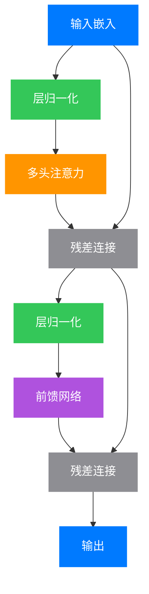
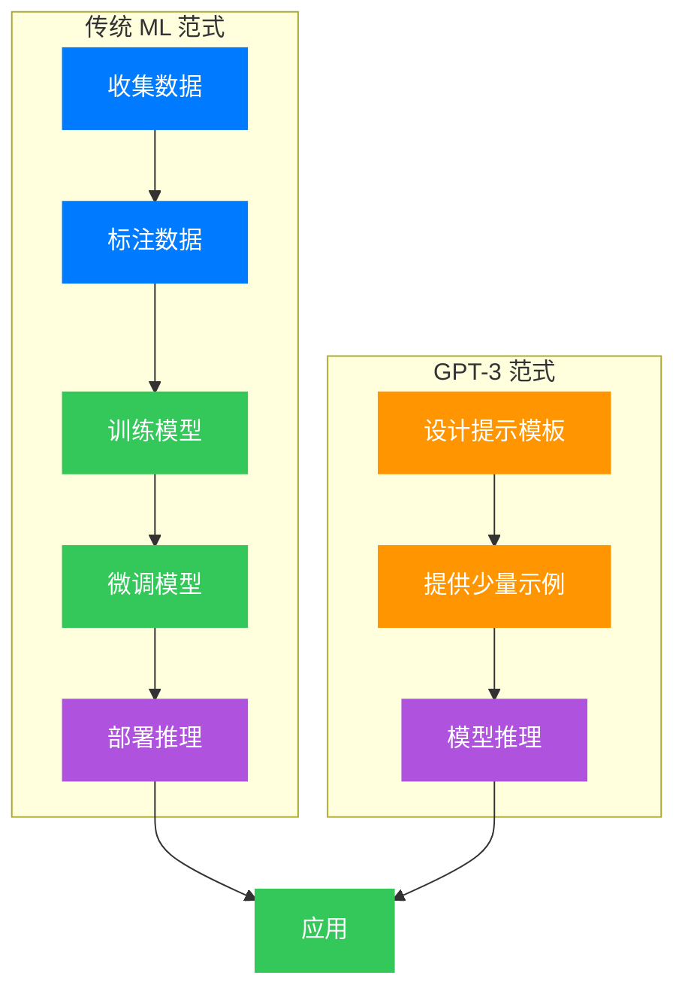

## 引言：从海量数据中学习

2020 年 6 月，OpenAI 发表了一篇注定载入人工智能史册的论文：《Language Models are Few-Shot Learners》。这篇论文介绍了 GPT-3——一个拥有 1750 亿参数的巨型语言模型。这个数字意味着什么？如果将 GPT-3 的参数全部打印出来，使用标准字体，这些纸张可以从地球堆到月球——再返回地球好几个来回。

但 GPT-3 的真正革命性之处不在于它的规模，而在于它展现出的**少样本学习能力（Few-Shot Learning）**。在此之前，如果我们想让一个 AI 模型完成翻译任务，需要用成千上万对双语句子"教"它；而 GPT-3 只需要看几个例子，就能理解任务并给出合理的输出。

这篇文章将带你走进 GPT-3 的世界，理解它背后的数学原理、技术架构，以及它如何改变了我们对人工智能的认知。

## 第一章：从 GPT-1 到 GPT-3 的演进之路

### 1.1 语言的统计本质

在深入 GPT-3 之前，让我们先思考一个基本问题：什么是语言模型？

从数学角度看，语言模型试图回答这样一个问题：给定一段已出现的词序列

<div class="math">
$$\mathbf{x}_{<i} = (x_1, x_2, \ldots, x_{i-1})$$
</div>

下一个词 $x_i$ 出现的概率是多少？用条件概率表示：

<div class="math">
$$P(x_i \mid \mathbf{x}_{<i}) = P(x_i \mid x_1, x_2, \ldots, x_{i-1})$$
</div>

整个句子的联合概率可以分解为：

<div class="math">
$$
P(\mathbf{x}) = \prod_{i=1}^{n} P(x_i \mid x_1, \ldots, x_{i-1})
$$
</div>

这就是**自回归语言模型（Autoregressive Language Model）**的核心思想：从左到右，逐个预测下一个词。

### 1.2 模型规模的指数级增长

GPT 系列的发展史，就是一部模型规模不断突破的历史：


*图 1：GPT 系列模型参数规模演变。从 GPT-1 的 1.17 亿参数到 GPT-3 的 1750 亿参数，两年内增长了近 1500 倍。*

| 模型 | 发布时间 | 参数量 | 层数 | 注意力头数 | 训练数据量 |
|:---:|:---:|:---:|:---:|:---:|:---:|
| GPT-1 | 2018.06 | 1.17 亿 | 12 | 12 | 5GB |
| GPT-2 | 2019.02 | 15 亿 | 48 | 16 | 40GB |
| GPT-3 | 2020.06 | 1750 亿 | 96 | 96 | 570GB |

这种规模的增长并非盲目追求"大"。OpenAI 团队在 2020 年初发表的另一篇论文《Scaling Laws for Neural Language Models》中，通过大量实验发现了一个令人惊讶的规律：**语言模型的性能与计算量、模型参数量和数据量之间存在幂律关系**。

具体来说，测试损失 $L$ 与计算量 $C$ 满足：

<div class="math">
$$L \propto C^{-\alpha}$$
</div>

其中 $\alpha \approx 0.05$ 是一个经验常数。这意味着，投入 10 倍的计算资源，损失大约只会下降 10%——但这 10% 的下降，往往对应着质的飞跃。


*图 2：训练计算量与测试损失的幂律关系。图中标注了 GPT-3 的训练位置（3640 PF-days）。*

### 1.3 涌现能力：量变引发质变

当我们将模型规模推向极致时，一些意想不到的能力开始"涌现"。GPT-3 展现出了以下关键能力：

**零样本学习（Zero-Shot Learning）**：不给任何例子，仅通过任务描述就能完成任务。例如：

```
翻译：将以下英文翻译成中文。
英文：The quick brown fox jumps over the lazy dog.
中文：
```

**单样本学习（One-Shot Learning）**：给一个例子，模型就能模仿：

```
翻译示例：
英文：Hello world → 中文：你好世界

英文：Machine learning is fascinating.
中文：
```

**少样本学习（Few-Shot Learning）**：给 10-100 个例子，模型能达到接近微调（fine-tuning）的效果。


*图 3：少样本学习性能随模型规模和示例数量的变化。可以看到，随着模型规模增大，少样本学习能力显著提升。*

## 第二章：Transformer 架构的精髓

### 2.1 注意力机制的本质

GPT-3 的核心架构是 Transformer 的**解码器（Decoder）**部分。要理解它，我们必须先理解**自注意力机制（Self-Attention）**。

想象你在阅读一句话："猫坐在垫子上，因为它很软。"当你读到"它"时，你会自动地将注意力集中在"垫子"上——这就是注意力机制想要模拟的人类认知过程。

数学上，自注意力可以表示为三个矩阵的运算。给定输入序列的嵌入表示 $\mathbf{X} \in \mathbb{R}^{n \times d}$，我们计算三个投影：

<div class="math">
$$
\mathbf{Q} = \mathbf{X} \mathbf{W}_Q, \quad \mathbf{K} = \mathbf{X} \mathbf{W}_K, \quad \mathbf{V} = \mathbf{X} \mathbf{W}_V
$$
</div>

其中

<div class="math">
$$\mathbf{W}_Q, \mathbf{W}_K, \mathbf{W}_V \in \mathbb{R}^{d \times d_k}$$
</div>

是可学习的参数矩阵，分别称为**查询（Query）**、**键（Key）**和**值（Value）**的投影矩阵。这三个名字来自数据库查询——Query 是你想找的内容，Key 是索引标签，Value 是实际内容。

注意力分数的计算使用了缩放点积注意力：

<div class="math">
$$
\text{Attention}(\mathbf{Q}, \mathbf{K}, \mathbf{V}) = \text{softmax}\left(\frac{\mathbf{Q} \mathbf{K}^T}{\sqrt{d_k}}\right) \mathbf{V}
$$
</div>

这里的 $\sqrt{d_k}$ 是缩放因子，防止内积过大导致 softmax 梯度消失。这就好比在图书馆找书——如果索引系统太"敏感"，相近的关键词会得分接近，难以区分；缩放因子让得分分布更加均匀，让模型更容易"做决定"。

### 2.2 多头注意力：并行关注不同方面

GPT-3 使用了**多头注意力（Multi-Head Attention）**，允许模型在不同的"表示子空间"中同时关注信息。这就好比让 96 个专家同时从不同角度分析同一句话——有的关注语法结构，有的关注语义关联，有的关注指代关系。

<div class="math">
$$
\text{MultiHead}(\mathbf{Q}, \mathbf{K}, \mathbf{V}) = \text{Concat}(\text{head}_1, \ldots, \text{head}_h) \mathbf{W}^O
$$
</div>

其中每个头独立计算：

<div class="math">
$$
\text{head}_i = \text{Attention}(\mathbf{X} \mathbf{W}_i^Q, \mathbf{X} \mathbf{W}_i^K, \mathbf{X} \mathbf{W}_i^V)
$$
</div>

GPT-3 使用了 $h = 96$ 个注意力头，隐藏维度 $d = 12288$，每个头的维度 $d_k = d / h = 128$。这意味着每一层有 96 个"视角"来理解输入，最终将这些视角融合得到全面的表示。

### 2.3 前馈网络与层归一化

每个 Transformer 层还包含一个前馈神经网络（Feed-Forward Network, FFN）：

<div class="math">
$$\text{FFN}(\mathbf{x}) = \max(0, \mathbf{x} \mathbf{W}_1 + \mathbf{b}_1) \mathbf{W}_2 + \mathbf{b}_2$$
</div>

这是一个两层的全连接网络，中间使用 ReLU 激活函数。在 GPT-3 中，FFN 的中间层维度是 $4d = 49152$。

层归一化（Layer Normalization）则稳定了训练过程：

<div class="math">
$$\text{LayerNorm}(\mathbf{x}) = \gamma \odot \frac{\mathbf{x} - \mu}{\sqrt{\sigma^2 + \epsilon}} + \beta$$
</div>

其中 $\mu$ 和 $\sigma^2$ 是输入的均值和方差，$\gamma$ 和 $\beta$ 是可学习的缩放和平移参数。这就像是给每一层的输出做"标准化体检"——确保数值分布保持健康，防止训练过程中数值爆炸或消失。

### 2.4 GPT-3 的完整架构

将上述组件组合起来，一个 Transformer 解码器层的计算流程如下：



**图例说明**：
- 🔵 蓝色节点：输入/输出
- 🟢 绿色节点：归一化操作
- 🟠 橙色节点：注意力机制
- 🟣 紫色节点：前馈网络
- ⚪ 灰色节点：残差连接

GPT-3 将这样的层堆叠了 96 次，配合 12288 维的隐藏层和 96 个注意力头，构成了这个庞然大物。


*图 4：主流 Transformer 模型架构对比。气泡大小代表参数量，横轴为层数，纵轴为隐藏层维度。*

## 第三章：训练 GPT-3——工程与艺术的结合

### 3.1 数据：互联网的语言

GPT-3 的训练数据来源于互联网的各个角落，经过精心筛选和过滤：

- **Common Crawl**：原始网页数据，经过质量过滤后占 60%
- **WebText2**：Reddit 上获得 3 个以上 karma 的网页链接，占 22%
- **Books1 和 Books2**：两个互联网图书语料库，占 16%
- **Wikipedia**：英文维基百科，占 3%

总计约 570GB 的文本数据，相当于约 5000 亿个 token（词片段）。

### 3.2 训练目标：最大似然估计

语言模型的训练目标是最大化训练数据的对数似然：

<div class="math">
$$\mathcal{L}(\theta) = \sum_{i=1}^{N} \log P_\theta(x_i \mid x_1, \ldots, x_{i-1})$$
</div>

等价地，最小化交叉熵损失：

<div class="math">
$$\mathcal{L}_{\text{CE}}(\theta) = -\frac{1}{N} \sum_{i=1}^{N} \sum_{j=1}^{|V|} y_{ij} \log \hat{y}_{ij}$$
</div>

其中 $|V|$ 是词汇表大小（GPT-3 使用约 5 万个 token），$y_{ij}$ 是真实标签的 one-hot 编码，$\hat{y}_{ij}$ 是模型预测的概率分布。

### 3.3 优化的挑战

训练 1750 亿参数的模型，是工程上的巨大挑战：

**模型并行（Model Parallelism）**：单个 GPU 无法容纳整个模型，需要将模型切分到多个设备上。就像一本厚书分成几卷，由不同的人同时阅读不同部分。

**数据并行（Data Parallelism）**：在多个 GPU 上同时处理不同批次的数据。这就像多个学生同时做不同的练习题，然后共享答案。

**梯度累积（Gradient Accumulation）**：在小 batch size 上累积梯度，模拟大 batch 的效果。好比攒够一周的垃圾再一起扔，而不是每次扔一点。

GPT-3 在 V100 GPU 集群上训练，使用了多种并行策略的组合。整个训练过程消耗了约 3640 PF-days（PetaFLOP-days）的计算量——如果在一个 V100 GPU 上训练，需要 355 年！

### 3.4 学习率调度与优化器

GPT-3 使用了 Adam 优化器的变体，配合 warm-up 和余弦退火的学习率调度：

<div class="math">
$$\eta_t = \eta_{\min} + \frac{1}{2}(\eta_{\max} - \eta_{\min})\left(1 + \cos\left(\frac{t}{T}\pi\right)\right)$$
</div>

其中 $T$ 是总训练步数，$t$ 是当前步数。这种调度方式让学习率平滑下降，有助于收敛到更好的局部最优。你可以把它想象成开车——起步时加速（warm-up），然后平稳行驶，最后缓慢刹车直到停止。这种"温柔"的减速比突然刹车更容易找到好的"停车位置"（局部最优解）。

## 第四章：少样本学习的数学原理

### 4.1 元学习的视角

少样本学习可以看作是一种**元学习（Meta-Learning）**，或者说"学习如何学习"。传统的监督学习可以形式化为：

<div class="math">
$$\theta^{\ast} = \arg\min_\theta \mathbb{E}_{(x, y) \sim \mathcal{D}}[\mathcal{L}(f_\theta(x), y)]$$
</div>

而元学习则学习一个先验，使得在面对新任务时只需要少量样本就能快速适应：

<div class="math">
$$\phi^{\ast} = \arg\min_\phi \mathbb{E}_{\mathcal{T} \sim p(\mathcal{T})}[\mathbb{E}_{(x, y) \sim \mathcal{D}_\mathcal{T}}[\mathcal{L}(f_{\theta(\phi, \mathcal{D}_\mathcal{T})}(x), y)]]$$
</div>

GPT-3 的独特之处在于，它没有显式的元学习过程，而是通过海量预训练，将"快速学习的能力"内化到了模型参数中。

### 4.2 上下文学习作为隐式梯度下降

斯坦福的研究者发现，上下文学习（In-Context Learning）可以看作是一种隐式的梯度下降。考虑一个线性回归的例子：

给定几个输入-输出对

<div class="math">
$$(x_1, y_1), (x_2, y_2), \ldots, (x_k, y_k)$$
</div>

模型需要预测新输入 $x_{\text{query}}$ 的输出。

标准的梯度下降更新为：

<div class="math">
$$\mathbf{w}_{t+1} = \mathbf{w}_t - \eta \nabla_{\mathbf{w}} \mathcal{L}(\mathbf{w}_t; \mathbf{X}, \mathbf{y})$$
</div>

而在上下文学习中，Transformer 的注意力机制实际上在执行类似的操作：

<div class="math">
$$\text{Attention}(\mathbf{Q}, \mathbf{K}, \mathbf{V}) = \mathbf{V} \cdot \text{softmax}\left(\frac{\mathbf{K}^T \mathbf{Q}}{\sqrt{d_k}}\right)$$
</div>

这个计算形式与梯度下降更新有着惊人的相似性——注意力权重可以被理解为"学习率"，而值向量则包含了参数的更新信息。这就像你在做作业时，参考之前的例题——注意力机制决定了你从每个例题中"学多少"，而值向量就是例题的答案。通过这种方式，模型可以在不更新参数的情况下，从上下文中的例子"学习"如何解决问题。


*图 5：上下文长度对模型性能的影响。更长的上下文允许模型看到更多示例，从而提升少样本学习效果。*

### 4.3 为什么模型越大，学得越快？

这一现象与**双 descent 现象**和**隐式正则化**有关。大模型拥有足够的容量来存储大量"原型"任务，同时又通过过参数化获得了良好的泛化能力。

从信息论角度看，模型的描述长度（Description Length）与训练数据复杂度之间存在权衡：

<div class="math">
$$L(\mathbf{y} \mid \mathbf{x}) \approx -\log P_\theta(\mathbf{y} \mid \mathbf{x}) + \|\theta\|_0$$
</div>

大模型虽然参数量大，但如果训练数据足够多样，它学到的表示可以高度压缩，从而实现良好的泛化。

## 第五章：GPT-3 的能力边界与应用

### 5.1 令人惊艳的表现

GPT-3 在多个基准测试上刷新了记录：

**语言理解与生成**：
- LAMBADA（完形填空）：86.4% 准确率，超越人类水平的 86.0%
- StoryCloze（故事推理）：87.7% 准确率

**问答与知识**：
- TriviaQA：71.2% 准确率（少样本设置）
- Natural Questions：29.9% 准确率

**翻译**：
- WMT14 英法翻译：39.5 BLEU
- WMT14 法英翻译：40.2 BLEU

**代码生成**：
GPT-3 展现出了惊人的代码理解和生成能力，尽管它的训练数据中代码占比很小。例如，给它一个函数签名和注释，它就能生成完整的实现代码。这启发了后来的 Codex 和 GitHub Copilot。

### 5.2 局限性与风险

然而，GPT-3 并非万能：

**常识推理的局限**：
尽管 GPT-3 能生成流畅的文本，但在需要深层常识推理的任务上，它仍然表现不佳。例如：

```
问：我把一个杯子放在桌子上，然后我把桌子翻过来，杯子在哪里？
GPT-3 可能会回答：杯子还在桌子上。
```

**事实准确性**：
GPT-3 会"一本正经地胡说八道"，生成看似合理但实际上错误的陈述。例如，问它"法国总统是谁"，它可能正确回答"马克龙"；但问"2024年法国总统是谁"，它可能会编造一个名字。这是因为它的目标是生成"合理的文本"，而非"真实的文本"——它更像一个"创意作家"而非"百科全书"。

**偏见与有害内容**：
训练数据中的偏见会被模型学习并放大。研究发现，GPT-3 在涉及性别、种族、宗教等话题时，会生成带有刻板印象的内容。

### 5.3 应用范式

GPT-3 催生了一种新的 AI 应用范式：**提示工程（Prompt Engineering）**。开发者不再需要大量标注数据和模型微调，而是通过精心设计的提示来引导模型的行为。



**图例说明**：
- 🔵 蓝色节点：数据准备
- 🟢 绿色节点：训练过程
- 🟠 橙色节点：提示设计
- 🟣 紫色节点：推理部署

## 第六章：从 GPT-3 到 GPT-4——未来展望

### 6.1 规模还能继续扩大吗？

Kaplan 等人的研究暗示，如果我们继续增加模型规模、计算量和数据量，性能还会继续提升。但这一路线面临多重挑战：

**计算成本**：GPT-3 的训练成本估计在数百万美元级别。继续扩大规模意味着指数级增长的投入。

**数据瓶颈**：互联网上的高质量文本数据是有限的。有研究估计，到 2026 年，大语言模型可能会"用尽"所有公开可用的文本数据。

**能耗与环境**：训练巨型模型的碳排放不容忽视。GPT-3 训练产生的碳足迹相当于多辆汽车一生的排放量。

### 6.2 新方向的探索

研究者们正在探索突破规模限制的新路径：

**混合专家模型（Mixture of Experts, MoE）**：
与其使用一个巨大的稠密模型，不如使用多个小型专家模型，通过一个门控网络动态选择激活哪些专家。这就像医院里有专科医生——心脏病、眼科、骨科各有专家，病人来了先挂号（门控），然后只看相关的专家。

<div class="math">
$$f(\mathbf{x}) = \sum_{i=1}^{N} g_i(\mathbf{x}) \cdot E_i(\mathbf{x})$$
</div>

其中 $g_i$ 是门控函数，$E_i$ 是第 $i$ 个专家网络。这样可以在大幅减少计算量的同时保持甚至提升模型容量。Google 的 Switch Transformer 就采用了这种架构，用 1.6 万亿参数打败了 GPT-3，但计算量只相当于其 1/4。

**检索增强生成（Retrieval-Augmented Generation, RAG）**：
将语言模型与外部知识库结合，在生成时动态检索相关信息，提高事实准确性。这就像考试时允许查阅资料——虽然你理解概念（预训练），但可以查具体事实（检索）。Facebook 的 RAG 模型和 OpenAI 后来在 ChatGPT 中加入的联网功能都是这种思路的体现。

**多模态融合**：
将文本模型与视觉、音频模型结合，构建真正理解世界的多模态智能。GPT-4 就是一个例子——它能理解图片、解读图表、分析梗图，这比纯文本模型更接近人类的多感官认知。

### 6.3 对 AI 研究范式的深远影响

GPT-3 的成功标志着 AI 研究范式的几个重要转变：

1. **从任务特定模型到通用模型**：不再为每个任务训练单独模型
2. **从监督学习到自监督学习**：利用海量未标注数据
3. **从模型设计到提示设计**：人类通过自然语言与模型交互
4. **从学术界主导到工业界主导**：大模型需要巨大的计算资源

## 结语：AGI 的曙光还是 hype？

GPT-3 的发布引发了关于通用人工智能（AGI）的激烈讨论。它是通往 AGI 的重要里程碑，还是又一个被过度炒作的技术？

从乐观的角度看，GPT-3 证明了：通过简单的自监督目标（预测下一个词）和足够的规模，模型可以涌现出令人惊讶的能力。这暗示了智能可能比我们想象的更简单、更统一。

从谨慎的角度看，GPT-3 缺乏真正的理解、意识和意图。它的"智能"只是统计规律的体现，而非对世界的深层认知。

无论如何，GPT-3 已经改变了自然语言处理的格局。它启发了 ChatGPT、GPT-4 等后续模型，推动了整个 AI 领域的发展。正如论文标题所言，语言模型确实是"少样本学习者"——而这一发现，可能只是 AI 能力冰山的一角。

当我们回望这段历史，2020 年的那个夏天，或许正是人工智能新时代的开端。

---

## 参考文献

1. Brown, T. B., Mann, B., Ryder, N., et al. (2020). Language Models are Few-Shot Learners. *NeurIPS 2020*.

2. Vaswani, A., Shazeer, N., Parmar, N., et al. (2017). Attention is All You Need. *NeurIPS 2017*.

3. Kaplan, J., McCandlish, S., Henighan, T., et al. (2020). Scaling Laws for Neural Language Models. *arXiv:2001.08361*.

4. Radford, A., Narasimhan, K., Salimans, T., & Sutskever, I. (2018). Improving Language Understanding by Generative Pre-Training.

5. Radford, A., Wu, J., Child, R., et al. (2019). Language Models are Unsupervised Multitask Learners.

6. Wei, J., Wang, X., Schuurmans, D., et al. (2022). Chain-of-Thought Prompting Elicits Reasoning in Large Language Models. *NeurIPS 2022*.

7. Xie, S. M., Raghunathan, A., Liang, P., & Ma, T. (2022). An Explanation of In-context Learning as Implicit Bayesian Inference. *ICLR 2022*.
