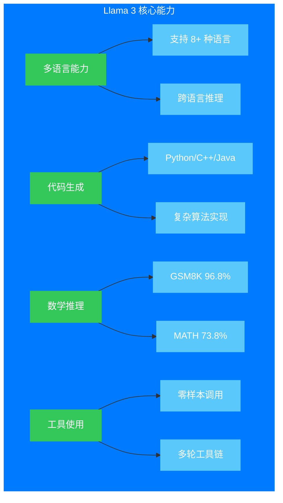
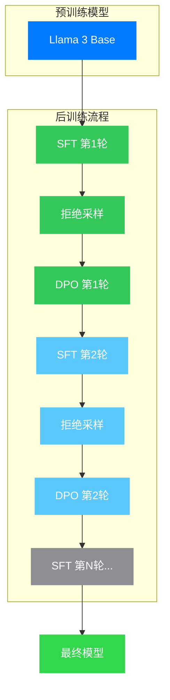
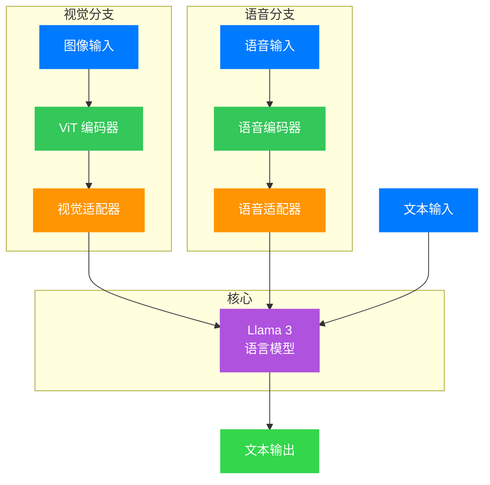

## 引言：开源 AI 的黎明

2024 年 7 月 23 日，Meta AI 发布了一篇重磅论文——《The Llama 3 Herd of Models》。这篇论文不仅介绍了一个拥有 4050 亿参数的巨型语言模型，更标志着开源人工智能正式迈入了与闭源巨头分庭抗礼的新纪元。

回想 2022 年底，ChatGPT 的横空出世让整个 AI 领域为之震动。然而，最强大的模型始终被封闭在 OpenAI、Google 等公司的围墙之内。研究者无法探究其内部机理，开发者无法自由定制，这种"黑箱"状态严重阻碍了 AI 技术的普惠发展。

Llama 3 的出现改变了这一切。Meta 不仅开源了完整的模型权重，还详细披露了从数据筛选到训练优化的每一个技术细节。这意味着，任何研究者和开发者都可以在自己的硬件上运行这个媲美 GPT-4 的模型，深入理解它的工作原理，甚至在此基础上进行创新。

本文将带领读者深入这篇 92 页的论文，从**数据、规模、复杂性管理**三个核心维度，层层剥开 Llama 3 的技术奥秘。

## 第一章：模型概览 —— "模型群"的设计理念

### 1.1 为什么叫 "Herd"（群）？

论文标题中的 "Herd of Models" 并非随意命名。Meta 同时发布了三个不同规模的模型：

| 模型 | 参数量 | 上下文长度 | 目标场景 |
|:---:|:---:|:---:|:---|
| Llama 3 8B | $8 \times 10^9$ | 128K tokens | 边缘设备、低延迟推理 |
| Llama 3 70B | $70 \times 10^9$ | 128K tokens | 平衡性能与效率 |
| Llama 3 405B | $405 \times 10^9$ | 128K tokens | 顶级性能、复杂推理 |

这种"群"策略的核心思想是：**用一个旗舰模型（405B）指导整个家族的优化方向，同时让每个成员在特定场景下发挥最大价值**。

### 1.2 核心能力矩阵

Llama 3 原生支持四大核心能力：

**图例说明**：
- 🔵 蓝色：核心概念
- 🟢 绿色：主要能力类别
- 🩵 浅蓝：具体能力指标

特别值得注意的是，Llama 3 8B 在某些基准测试上已经超过了 Llama 2 70B 的表现。这种"以小博大"的能力提升，正是数据质量和训练策略优化的直接体现。

## 第二章：预训练的艺术 —— 数据为王

### 2.1 数据规模的跃升

Llama 3 的预训练数据量达到了惊人的 **15.6 万亿 tokens**，相比 Llama 2 的 1.8 万亿，增长了近 9 倍。这个数字是什么概念？

假设一本书平均有 10 万字，15.6 万亿 tokens 大约相当于：

$$
\frac{15.6 \times 10^{12}}{10^5} \approx 1.56 \times 10^8 \text{ 本书}
$$

约 **1.56 亿本书**！这几乎涵盖了人类文明的绝大部分书面知识。

### 2.2 数据质量筛选的五重关卡

Meta 构建了一套工业级的数据清洗流水线，包含五个关键步骤：

#### 第一关：安全与隐私过滤

- 移除含有不安全内容的域名
- 过滤成人内容
- 清除个人身份信息（PII）

#### 第二关：文本提取与清洗

Meta 开发了一个自定义 HTML 解析器，相比第三方工具（如 BeautifulSoup），它在两个关键指标上更优：
- **模板去除精度**：准确识别并移除导航栏、广告、版权声明等"样板"内容
- **内容召回率**：确保不遗漏正文、数学公式、代码块等有价值信息

有趣的是，**实验发现 Markdown 格式对模型性能有害**，因此所有 Markdown 标记都被移除，仅保留纯文本。

#### 第三关：三级去重策略

| 去重级别 | 方法 | 目的 |
|:---:|:---|:---|
| URL 级 | 全局 URL 去重 | 保留每页面的最新版本 |
| 文档级 | MinHash 算法 | 删除近似重复文档 |
| 行级 | 桶内行频率统计 | 移除残留模板（如导航菜单）|

行级去重采用激进策略：**在每个 3000 万文档的桶中，出现超过 6 次的行会被删除**。这虽然会误伤一些常用短语，但整体质量提升明显。

#### 第四关：启发式过滤

使用多种启发式规则剔除低质量内容：
- **重复 $n$-gram 覆盖率**：识别日志文件、错误消息等重复内容
- **脏词计数**：捕获未被域名黑名单覆盖的成人内容
- **KL 散度异常检测**：过滤含有过多异常 token 的文档

#### 第五关：模型质量评分

这是最关键的一步。Meta 使用 Llama 2 作为"教师模型"，训练了一系列质量分类器：

1. **通用质量分类器**：基于 Llama 2 的判断，预测文档是否"值得被 Wikipedia 引用"
2. **代码专用分类器**：识别包含代码和自然语言交织的文档
3. **数学推理分类器**：筛选 STEM 领域的推理内容

### 2.3 数据配比的艺术

最终的数据组成大致为：

- **网页数据**：约 50%（经严格筛选）
- **代码数据**：约 17%
- **多语言数据**：约 17%（覆盖 8+ 种语言）
- **数学/推理数据**：约 10%
- **其他**：约 6%

这种精心设计的配比，确保了模型在各个维度上的均衡发展。

## 第三章：Scaling Laws —— 规模的科学

### 3.1 Chinchilla 最优 vs Llama 3 策略

2022 年，DeepMind 的 Chinchilla 论文提出了著名的 Scaling Laws：

$$
L(N, D) = \frac{A}{N^{\alpha}} + \frac{B}{D^{\beta}} + L_{\infty}
$$

其中：
- $N$ 是模型参数量
- $D$ 是训练数据量
- $L$ 是验证损失
- $\alpha \approx 0.5$, $\beta \approx 0.5$

根据 Chinchilla 最优计算，给定 $3.8 \times 10^{25}$ FLOPs 的算力预算，最优配置约为 **400B 参数 + 400B tokens**。

然而，Llama 3 405B 使用了 **15.6 万亿 tokens**——这是计算最优配置的 **39 倍**！

### 3.2 为什么"过训练"？

Meta 刻意选择了"过训练"（over-training）策略，原因有三：

1. **推理效率优先**：在相同的推理预算下，小模型 + 多数据 往往优于 大模型 + 少数据
2. **知识密度**：更多的数据曝光让模型"记住"更多知识
3. **下游任务泛化**：充分训练使模型更好地内化语言规律

从图中可以看到，Llama 3 的三个模型都位于 Chinchilla 最优曲线的右上方——这意味着它们都经过了"过训练"。但这种策略换来了什么呢？

**答案是：更强的推理能力**。对于实际部署，推理成本往往远超训练成本。一个训练充分的小模型，可以比同等推理成本下的大模型表现更好。

### 3.3 训练计算量分布

Llama 3 405B 的总训练计算量约为 $3.8 \times 10^{25}$ FLOPs，分布如下：

预训练阶段消耗了绝大部分算力（约 90%），这符合"数据密集型"训练的特点。

## 第四章：模型架构 —— 保守中的创新

### 4.1 坚持 Dense Transformer

当 GPT-4、Mixtral 等模型纷纷采用 MoE（Mixture of Experts，专家混合）架构时，Llama 3 选择了相对保守的 **Dense Transformer**——即每个参数都参与每次前向传播。

这个决策背后的考量是：**最大化训练稳定性**。

MoE 架构虽然可以在相同激活参数下扩展总参数量，但带来了额外的复杂性：
- 路由机制的不稳定性
- 负载均衡的挑战
- 专家崩溃（expert collapse）风险

对于需要稳定训练数月、消耗数亿美元算力的旗舰模型，**简单即美德**。

### 4.2 关键架构参数

| 参数 | Llama 3 8B | Llama 3 70B | Llama 3 405B |
|:---|:---:|:---:|:---:|
| 层数 $L$ | 32 | 80 | 126 |
| 模型维度 $d_{model}$ | 4096 | 8192 | 16384 |
| 注意力头数 $n_h$ | 32 | 64 | 128 |
| 每头维度 $d_h$ | 128 | 128 | 128 |
| 上下文长度 | 128K | 128K | 128K |
| 词汇表大小 $|V|$ | 128K | 128K | 128K |

### 4.3 分组查询注意力（GQA）

Llama 3 采用了 **Grouped-Query Attention（GQA）**，这是提升推理效率的关键设计。

标准多头注意力（MHA）中，每个注意力头都有独立的查询（Query）、键（Key）、值（Value）投影：

$$
\text{Attention}(\mathbf{Q}, \mathbf{K}, \mathbf{V}) = \text{softmax}\left(\frac{\mathbf{Q}\mathbf{K}^T}{\sqrt{d_k}}\right)\mathbf{V}
$$

在 GQA 中，多个查询头共享同一组键和值头：

- **Llama 3 8B**：8 个 KV 头（4 个查询头共享 1 个 KV 头）
- **Llama 3 70B/405B**：8 个 KV 头（8/16 个查询头共享 1 个 KV 头）

这带来了显著的内存节省。对于长度为 $L$、维度为 $d$ 的序列，KV Cache 的内存占用从 $O(L \cdot n_h \cdot d)$ 降低到 $O(L \cdot n_{kv} \cdot d)$，其中 $n_{kv} \ll n_h$。

### 4.4 RoPE 位置编码的演进

Llama 3 继续使用 **Rotary Position Embedding（RoPE）**，但对基础频率进行了调整：

$$
\text{RoPE}(\mathbf{x}, m) = \mathbf{x} \odot e^{i m \theta_j}
$$

其中 $\theta_j = \theta_{base}^{-2(j-1)/d}$，$j$ 是维度索引。

关键调整：
- **基础频率** $\theta_{base}$ 从 Llama 2 的 10000 提升到 **500000**
- 这使得模型能更好地处理长距离依赖，支持长达 128K tokens 的上下文

## 第五章：长上下文 —— 从 8K 到 128K 的进化

### 5.1 渐进式扩展策略

Llama 3 并非一开始就训练 128K 上下文，而是采用了**渐进式扩展**策略：

具体步骤：
1. **预训练阶段**：使用 8K 上下文进行主要训练
2. **继续预训练**：逐步增加上下文长度，从 8K → 16K → 32K → 64K → 128K
3. **退火阶段**：在高质量数据上进行长上下文微调

### 5.2 关键技术：文档掩码

长上下文训练的一个关键创新是**文档间掩码**（Inter-document Masking）：

在标准预训练中，同一批次的不同文档被拼接成一个长序列。传统方法允许注意力跨越文档边界，但 Llama 3 引入了一种特殊的注意力掩码——**禁止不同文档之间的注意力**。

这种设计的直觉是：
- 来自不同文档的 token 没有语义关联
- 强制模型专注于文档内部的长期依赖
- 在长序列上保持训练稳定性

### 5.3 性能验证：Needle-in-Haystack

为了验证长上下文能力，Meta 使用了经典的 "大海捞针" 测试：在一个极长文档的随机位置插入一句特定的话（"针"），然后要求模型检索这句话。

从右侧图可以看到，即使在 128K tokens 的全长度下，Llama 3 的检索准确率仍保持在 97% 左右。这意味着模型可以可靠地处理整本书、长篇文章或大量代码库。

## 第六章：后训练的艺术 —— 从语言模型到助手

### 6.1 后训练流程概览

预训练后的模型虽然掌握了语言知识和世界知识，但它还**不会按照指令行事**。后训练的目标是将这个"知识库"转化为"有用且安全的助手"。

Llama 3 的后训练采用了一个相对简单但有效的流程：

### 6.2 监督微调（SFT）

SFT 阶段使用人工标注的高质量指令数据。关键策略包括：

- **多样化数据**：涵盖问答、代码、数学、推理、工具使用等多种任务
- **多语言覆盖**：确保非英语能力不退化
- **质量筛选**：使用模型自动评估 + 人工审核，只保留高质量样本

### 6.3 拒绝采样（Rejection Sampling）

这是一个提升模型推理能力的巧妙技巧：

1. 给定一个问题，让当前模型生成 $N$ 个候选答案（$N$ 通常设为 4-8）
2. 使用奖励模型或人工标准，评估每个答案的质量
3. 只保留最高分答案，用它构造新的训练样本
4. 用这些"精选"样本继续 SFT

这相当于让模型**反复练习它最擅长的解法**，类似于学生的"错题本"学习法。

### 6.4 直接偏好优化（DPO）

DPO 是 Llama 3 对齐人类偏好的核心算法。相比传统的 RLHF（基于人类反馈的强化学习），DPO 更简单高效。

核心思想是：对于每个查询，收集一对回答 $(y_w, y_l)$，其中 $y_w$ 是人类偏好的"胜"回答，$y_l$ 是"负"回答。DPO 直接优化以下目标：

$$
\mathcal{L}_{\text{DPO}} = -\mathbb{E}_{(x, y_w, y_l)}\left[\log \sigma\left(\beta \log \frac{\pi_\theta(y_w|x)}{\pi_{\text{ref}}(y_w|x)} - \beta \log \frac{\pi_\theta(y_l|x)}{\pi_{\text{ref}}(y_l|x)}\right)\right]
$$

其中：
- $\pi_\theta$ 是当前策略（待优化的模型）
- $\pi_{\text{ref}}$ 是参考策略（通常是 SFT 后的模型）
- $\beta$ 是温度参数，控制优化强度

直观理解：DPO 试图**最大化胜回答与负回答之间的对数概率差距**，同时不要让模型偏离参考策略太远。

## 第七章：多模态扩展 —— 看得懂、听得见的 Llama

### 7.1 组合式架构设计

除了纯文本模型，论文还介绍了 Llama 3 的多模态扩展——图像理解和语音识别能力。关键在于**组合式（Compositional）设计**：

不从头训练一个端到端多模态模型，而是将**预训练的视觉/语音编码器**与**预训练的语言模型**通过轻量级适配器连接起来。

**图例说明**：
- 🔵 蓝色：输入模态
- 🟢 绿色：预训练编码器
- 🟠 橙色：可训练适配器
- 🟣 紫色：冻结的语言模型核心
- 🟢 浅绿：输出

### 7.2 视觉适配器训练

视觉分支采用 **Cross-Attention 适配器**：

1. 使用预训练的 Vision Transformer（ViT）提取图像特征
2. 在语言模型的每一层插入 Cross-Attention 层
3. Cross-Attention 的 Query 来自语言模型，Key/Value 来自 ViT
4. **关键**：训练时只更新适配器和 ViT 的参数，**语言模型参数冻结**

这种设计的优势：
- 保留语言模型的全部能力
- 避免多模态训练"破坏"语言能力
- 可独立优化视觉-语言对齐

### 7.3 视频理解扩展

在图像适配器基础上，通过添加**时序聚合器**（Temporal Aggregator）实现视频理解：

- 采样多帧图像，分别通过图像编码器
- 使用时序注意力聚合帧间信息
- 支持时序推理（如"视频中发生了什么"）

实验表明，即使在较少的视频数据上训练，这种架构也能达到与专用视频模型竞争的性能。

### 7.4 语音适配器

语音分支采用类似的策略：

1. **语音编码器**：基于 Conformer 架构，预训练于海量语音数据
2. **适配器**：将语音表示映射到语言模型的 token 空间
3. **训练**：联合优化适配器和编码器，语言模型冻结

值得注意的是，语音适配器训练后，模型可以直接理解语音指令并生成文本回答，实现了**端到端的语音交互**。

## 第八章：性能评估 —— 与 GPT-4 的正面对决

### 8.1 基准测试结果

Llama 3 405B 在主流基准测试上的表现：

从图中可以观察到几个关键结论：

1. **规模效应显著**：从 8B 到 405B，各维度能力几乎单调提升
2. **代码能力突出**：HumanEval 上 405B 达到 89%，超越 GPT-4
3. **数学推理强劲**：GSM8K 96.8%、MATH 73.8%，均达到顶尖水平
4. **小模型也有竞争力**：8B 版本在多项任务上超越 Llama 2 70B

### 8.2 人工评估

除了自动基准测试，Meta 还进行了大规模人工评估。评估者被给予同一问题的两个模型回答（盲测），需要选择更好的那个。

结果：Llama 3 405B 在**有用性**和**事实准确性**上均与 GPT-4 持平，在**代码生成**和**数学推理**上甚至略有优势。

### 8.3 安全性评估

Meta 对 Llama 3 进行了全面的安全评估：

- **Llama Guard 3**：内置的输入/输出安全分类器
- **越狱测试**：包括多轮对话越狱、长上下文越狱等
- **偏见评估**：在多个维度上评估模型的公平性

结果显示，Llama 3 在保持高有用性的同时，显著降低了有害输出率。这得益于后训练阶段的**安全数据混合**和**对齐优化**。

## 第九章：工程实践 —— 训练 405B 模型的技术挑战

### 9.1 4D 并行策略

训练 405B 模型需要数千张 GPU 协同工作。Meta 采用了 **4D 并行**策略：

| 并行维度 | 作用 | 通信特点 |
|:---:|:---|:---|
| **TP** 张量并行 | 将单层网络拆分到多卡 | 高带宽、低延迟（机内）|
| **CP** 上下文并行 | 将长序列分段处理 | 中等带宽（机内/机间）|
| **PP** 流水线并行 | 将模型分层拆分到多机 | 中等延迟容忍 |
| **DP** 数据并行 | 多副本并行处理不同数据 | 梯度同步（全局）|

并行顺序经过精心设计：**[TP, CP, PP, DP]**。这种排序确保了：
- 通信最密集的 TP 在 NVLink 内部完成
- CP 利用机内高速互联
- PP 和 DP 可以跨越机架，容忍更高延迟

### 9.2 FP8 量化训练

为了在 H100 GPU 上高效训练，Meta 采用了 **FP8（8-bit 浮点）量化**：

- 前向传播：权重和激活使用 FP8
- 反向传播：梯度使用 FP8
- 关键层（第一层、最后一层）保持 BF16
- 使用**逐行量化**（Row-wise Quantization）和**动态缩放**保证精度

实验表明，FP8 训练相比 BF16 几乎没有精度损失，但吞吐量提升显著。

### 9.3 故障恢复机制

在数月的大规模训练中，硬件故障不可避免。Meta 的应对策略：

- **高频 checkpoint**：每 50-100 步保存状态
- **异步 checkpoint**：不阻塞训练流水线
- **自动故障检测**：监控 GPU 健康状态
- **弹性重启**：自动从最近 checkpoint 恢复

据统计，整个训练过程中经历了数百次各类故障，但都通过自动化机制无缝恢复。

## 结语：开源 AI 的新纪元

Llama 3 的发布不仅是技术里程碑，更是 AI 发展范式的转折点。

回顾这篇论文的核心贡献：

1. **数据**：15.6 万亿 tokens 的高质量语料，证明了数据质量与数量的同等重要性
2. **规模**：405B 参数 + 3.8×10²⁵ FLOPs，展示了 Dense Transformer 架构的极限潜力
3. **效率**：GQA、4D 并行、FP8 量化等工程创新，让大规模训练成为可能
4. **开放**：完整开源模型权重和技术细节，推动 AI 民主化

更重要的是，Llama 3 证明了**开源模型可以与闭源巨头抗衡**。这不是终点，而是新起点——一个研究者可以自由探索、开发者可以按需定制、企业可以自主部署的 AI 新时代。

未来，当我们回望 2024 年，或许会将其视为"开源 AI 元年"。而《The Llama 3 Herd of Models》这篇论文，就是这一历史转折的见证者和推动者。

## 参考阅读

- 论文原文：[The Llama 3 Herd of Models](https://arxiv.org/abs/2407.21783)
- 模型下载：[Llama 官网](https://llama.meta.com/)
- 技术博客：[Meta AI Blog](https://ai.meta.com/blog/)

---

本文图表说明：

- Scaling Laws 对比图：展示了 Llama 3 各模型相对于 Chinchilla 最优曲线的位置
- 上下文演化图：呈现了从 8K 到 128K 的训练阶段和性能保持
- 基准对比图：Llama 3 系列与 GPT-4 在主流测试集上的性能比较
- 计算量分布图：各训练阶段消耗的算力比例
