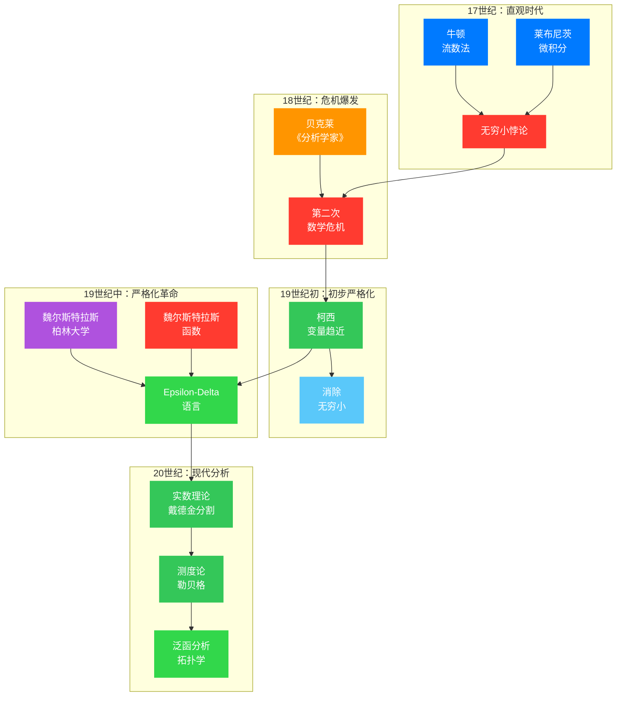

## 引言：一个困惑的大数学家

1999年，在接受美国数学学会（AMS）的采访时，20世纪最杰出的数学家之一——让-皮埃尔·塞尔（Jean-Pierre Serre）被问及他对数学教育的看法。这位在代数几何、拓扑学和数论领域做出了奠基性贡献的菲尔兹奖得主，给出了一个令人意外的回答：

> *"我从来没有真正搞懂过 epsilon-delta 语言。我总是通过直观的邻域概念来理解极限和连续性。"*

塞尔不是第一个对 epsilon-delta 语言感到困惑的人，也不会是最后一个。每年，数以万计的本科生在第一次接触这套符号系统时，都会经历从困惑到恍然大悟（或持续的困惑）的心路历程。

但这个让塞尔都感到棘手的语言，却成为了现代数学分析的基石。它诞生于19世纪中叶的数学危机，由卡尔·魏尔斯特拉斯（Karl Weierstrass）系统化，并在随后的一个多世纪里，塑造了我们今天理解连续性、极限和微积分的方式。

这就引出了一个根本性的问题：**epsilon-delta 语言到底重不重要？它真的必要吗？还是如塞尔所言，直觉的理解就已足够？**

让我们一起回溯这段数学史，从牛顿和莱布尼茨的时代开始，穿越第二次数学危机的风暴，最终抵达严格化的彼岸。

## 第一章：微积分的光荣与混沌

### 1.1 直观的时代

1687年，牛顿发表了《自然哲学的数学原理》，莱布尼茨也在同一时期独立发展出微积分。这套革命性的工具使得数学家们能够描述运动、变化率和累积量，但其基础却建立在一个模糊的概念之上——**无穷小**。

让我们看看牛顿是如何计算导数的。对于函数 $f(x) = x^2$，牛顿考虑：

$$
f(x + o) - f(x) = (x + o)^2 - x^2 = 2xo + o^2
$$

其中 $o$ 是一个**无穷小量**——既不为零（因此可以作除数），又小到可以忽略不计。于是：

$$
\frac{f(x + o) - f(x)}{o} = 2x + o \approx 2x
$$

最终的答案是 $2x$，但这个过程充满了逻辑上的暧昧：$o$ 到底是不是零？如果是，为什么要写成 $2x + o$ 而非 $2x$？如果不是，为什么最后又把它"扔掉"了？

大主教乔治·贝克莱（George Berkeley）在1734年的《分析学家》中辛辣地讽刺道：

> *"这些流数（fluxions，牛顿的术语）是什么？是消逝的增量的速度。那么这些消逝的增量是什么？它们既不是有限的量，也不是无穷小的量，但也不是无。难道我们不能称它们为消逝的量的鬼魂吗？"*

贝克莱的批评并非无理取闹。无穷小的概念确实充满了内在的矛盾：它既要参与运算（所以不能是零），又要在最后消失（所以必须被忽略）。这种"既要又要"的逻辑，在当时被称为**无穷小的悖论**。

### 1.2 柯西的初步严格化

到了19世纪初，数学家们开始意识到问题的严重性。奥古斯丁-路易·柯西（Augustin-Louis Cauchy）在他的《分析教程》（1821年）中做出了重要的第一步。

柯西尝试用**变量趋近**的概念来取代神秘的无穷小：

> *"当一个变量的数值以这样一种方式无限接近一个固定的值，以至于最终与它的差值可以小到任意程度，这个固定的值就被称为所有其他值的极限。"*

用现代的符号表示，柯西会说：当 $x$ 趋近于 $a$ 时，$f(x)$ 的极限是 $L$，如果 $f(x)$ "最终"与 $L$ 的差可以任意小。

这是一个巨大的进步，但问题依然存在：**什么是"最终"？什么是"任意小"？** 这些词汇虽然比"无穷小"更加直观，但仍然缺乏严格的数学定义。

柯西本人有时也会不自觉地使用无穷小。例如，他在证明连续函数的中值定理时，实际上依赖于几何直观而非严格的逻辑推导。这暴露了直观方法的局限性：**它虽然有效，但不够可靠**。

让我们通过一张图来理解这种直观与严格之间的差距：

图：极限概念的三种理解方式——从直观到严格的演进

从左到右，我们看到：
- **直观理解**：用"趋近于"这样的动态语言描述
- **无穷小方法**：引入神秘的 $dx$ 概念
- **Epsilon-Delta**：用严格的定量关系定义极限

## 第二章：第二次数学危机

### 2.1 危机的爆发

19世纪初的数学界正经历一场深刻的危机。微积分的应用已经硕果累累——从经典力学到电磁学，从天体力学到热力学——但它的逻辑基础却摇摇欲坠。

问题的核心在于：**没有严格的极限定义，就无法确定哪些操作是合法的**。

让我们看一个具体的例子。考虑函数序列：

$$
f_n(x) = \frac{\sin(nx)}{n}
$$

对于每一个固定的 $n$，$f_n(x)$ 都是连续函数。当 $n \to \infty$ 时，这个序列逐点收敛到 $f(x) = 0$，这也是一个连续函数。

但如果考虑导数呢？

$$
f_n'(x) = \cos(nx)
$$

当 $n \to \infty$ 时，$f_n'(x)$ 根本不收敛（它在 $-1$ 和 $1$ 之间振荡），但 $f'(x) = 0$。

这说明：**连续函数的极限是连续的，但连续函数导数的极限却不一定是导数的极限**。这种细微的区别在直观方法中很难被察觉，却可能导致严重的错误。

### 2.2 连续函数的反直觉性质

更惊人的发现还在后面。1872年，魏尔斯特拉斯构造了一个函数：

$$
W(x) = \sum_{n=0}^{\infty} a^n \cos(b^n \pi x)
$$

其中 $0 < a < 1$，$b$ 是一个奇整数，且 $ab > 1 + \frac{3\pi}{2}$。

这个函数有一个惊人的性质：**它在每一点都连续，但在每一点都不可导**。

图：魏尔斯特拉斯函数——处处连续但处处不可导的怪物

这对直观理解是毁灭性的打击。在魏尔斯特拉斯之前，数学家们普遍相信：连续函数"除了可能在个别点之外"总是可导的。毕竟，连续意味着"一笔画成"，而"一笔画成"的曲线怎么可能没有切线呢？

魏尔斯特拉斯的函数证明这种直觉是错误的。**连续性和可导性之间存在巨大的鸿沟**，而如果没有严格的定义，我们甚至无法准确地描述这种鸿沟。

这就像是说：我们都知道什么是"光滑"，但当有人画出一个连续但处处是尖角的曲线时，我们才意识到"光滑"需要一个精确的定义。

### 2.3 对严格化的呼唤

这些反例让数学界清醒地认识到：**直观是不可靠的，我们需要严格的定义**。

问题的关键是如何定义"极限"、"连续"、"导数"这些基本概念。我们需要一套语言，能够：

1. **精确地表达**：不含糊，没有"任意小"或"最终"这样的模糊词汇
2. **可操作**：能够用于证明和计算
3. **足够一般**：适用于各种函数和序列

这正是 epsilon-delta 语言诞生的历史背景。

## 第三章：魏尔斯特拉斯的革命

### 3.1 Epsilon-Delta 的诞生

1860年代，柏林大学的卡尔·魏尔斯特拉斯（Karl Weierstrass）在课堂上引入了今天我们称之为 epsilon-delta 的定义。这套定义并没有在他生前发表，而是通过他的学生传播开来，逐渐成为标准。

魏尔斯特拉斯的关键洞见是：**用两个正数 $\epsilon$ 和 $\delta$ 的定量关系来取代模糊的"趋近"概念**。

**极限的严格定义**：

我们说 $\lim_{x \to a} f(x) = L$，如果：

$$\forall \epsilon > 0, \exists \delta > 0 \text{ 使得 } 0 < |x - a| < \delta \Rightarrow |f(x) - L| < \epsilon$$

让我们逐字解析这个定义：

- **$\forall \epsilon > 0$**（对于任意给定的正数 $\epsilon$）：无论你把误差范围设得多小
- **$\exists \delta > 0$**（存在一个正数 $\delta$）：我总能找到一个邻域半径
- **$0 < |x - a| < \delta$**（当 $x$ 与 $a$ 的距离小于 $\delta$ 但不等于 $a$ 时）：只要 $x$ 足够接近 $a$
- **$|f(x) - L| < \epsilon$**（$f(x)$ 与 $L$ 的距离就小于 $\epsilon$）：$f(x)$ 就会落在误差范围内

这个定义的精髓在于：**它把"无限接近"转化成了"任意接近"**，并且用明确的量词关系刻画了这种接近。

### 3.2 定义的可视化

让我们用一张图来理解这个定义：

图：Epsilon-Delta 定义的可视化——函数 $f(x) = x^2$ 在 $x = 2$ 处的连续性

这张图展示了：
- **橙色带状区域**：误差范围 $L \pm \epsilon$，即 $|f(x) - L| < \epsilon$
- **绿色带状区域**：邻域 $(a - \delta, a + \delta)$，即 $|x - a| < \delta$
- **核心条件**：绿色区域被映射到橙色区域内

直观地说：无论你给我多窄的橙色误差带（$\epsilon$），我总能找到一个绿色邻域（$\delta$），使得这个邻域内的所有点都映射到橙色带内。

### 3.3 连续性的严格定义

有了极限的严格定义，连续性也就呼之欲出了：

**连续性的 Epsilon-Delta 定义**：

函数 $f$ 在点 $a$ 处连续，如果：

$$\forall \epsilon > 0, \exists \delta > 0 \text{ 使得 } |x - a| < \delta \Rightarrow |f(x) - f(a)| < \epsilon$$

注意与极限定义的区别：这里我们没有要求 $0 < |x - a|$，也就是说 $x = a$ 时条件也必须成立。而这自然成立，因为 $|f(a) - f(a)| = 0 < \epsilon$。

这个定义完美地捕捉了我们直觉中的"没有跳跃"：无论你要求多高的精度（$\epsilon$），函数在 $a$ 点附近总能满足这个精度要求（通过选择合适的 $\delta$）。

### 3.4 不同类型的间断点

严格定义的价值在于，它能够精确区分不同类型的连续性"破坏"。

图：连续性的分类——可去间断点、跳跃间断点、本质间断点

让我们看四种情况：

1. **连续函数**（左上）：$f(x) = x^2$，满足 epsilon-delta 定义
2. **可去间断点**（右上）：$f(x) = \frac{\sin x}{x}$（补充定义 $f(0) = 1$），极限存在但不等于函数值
3. **跳跃间断点**（左下）：符号函数，左右极限存在但不相等
4. **本质间断点**（右下）：$f(x) = \sin\left(\frac{1}{x}\right)$，极限根本不存在

epsilon-delta 语言让我们能够精确定义这些区别：

- **可去间断点**：$\lim_{x \to a} f(x)$ 存在但不等于 $f(a)$（或 $f(a)$ 无定义）
- **跳跃间断点**：$\lim_{x \to a^-} f(x)$ 和 $\lim_{x \to a^+} f(x)$ 都存在但不相等
- **本质间断点**：至少一个单侧极限不存在

## 第四章：深入推导——从定义到定理

### 4.1 证明极限的基本技巧

让我们通过一个具体的例子，展示如何用 epsilon-delta 语言证明极限。

**命题**：$\lim_{x \to 2} x^2 = 4$

**证明**：

给定任意 $\epsilon > 0$，我们需要找到 $\delta > 0$ 使得：

$$
0 < |x - 2| < \delta \Rightarrow |x^2 - 4| < \epsilon
$$

首先分析 $|x^2 - 4|$：

$$
|x^2 - 4| = |x - 2| \cdot |x + 2|
$$

如果 $|x - 2| < 1$（即 $1 < x < 3$），那么 $|x + 2| < 5$。

于是：

$$
|x^2 - 4| = |x - 2| \cdot |x + 2| < 5|x - 2|
$$

为了使 $|x^2 - 4| < \epsilon$，只需 $5|x - 2| < \epsilon$，即 $|x - 2| < \frac{\epsilon}{5}$。

因此，取 $\delta = \min\left(1, \frac{\epsilon}{5}\right)$，我们有：

$$
|x - 2| < \delta \Rightarrow |x^2 - 4| < 5 \cdot \frac{\epsilon}{5} = \epsilon
$$

证毕。

这个证明展示了 epsilon-delta 证明的标准模式：

1. **分析目标**：将 $|f(x) - L|$ 表示为 $|x - a|$ 的函数
2. **控制辅助项**：通常需要假设 $|x - a|$ 小于某个常数（这里是1）来控制其他因子
3. **选择 $\delta$**：根据分析结果，构造合适的 $\delta$
4. **验证**：检查所选的 $\delta$ 确实满足要求

### 4.2 极限的代数性质

有了严格定义，我们就可以严格证明极限的代数性质。

**定理**：如果 $\lim_{x \to a} f(x) = L$ 且 $\lim_{x \to a} g(x) = M$，那么：

$$
\lim_{x \to a} [f(x) + g(x)] = L + M
$$

**证明**：

给定 $\epsilon > 0$。我们需要找到 $\delta > 0$ 使得：

$$
0 < |x - a| < \delta \Rightarrow |[f(x) + g(x)] - [L + M]| < \epsilon
$$

由于 $\lim_{x \to a} f(x) = L$，存在 $\delta_1 > 0$ 使得：

$$
0 < |x - a| < \delta_1 \Rightarrow |f(x) - L| < \frac{\epsilon}{2}
$$

同理，由于 $\lim_{x \to a} g(x) = M$，存在 $\delta_2 > 0$ 使得：

$$
0 < |x - a| < \delta_2 \Rightarrow |g(x) - M| < \frac{\epsilon}{2}
$$

取 $\delta = \min(\delta_1, \delta_2)$，则当 $0 < |x - a| < \delta$ 时：

$$
\begin{align}
|[f(x) + g(x)] - [L + M]| &= |[f(x) - L] + [g(x) - M]| \\
&\leq |f(x) - L| + |g(x) - M| \\
&< \frac{\epsilon}{2} + \frac{\epsilon}{2} = \epsilon
\end{align}
$$

证毕。

这个证明展示了严格方法的威力：**通过将 $\epsilon$ 分配给各项，我们能够精确控制误差**。这种"$\epsilon/2$ 论证"是分析学中的标准技巧。

### 4.3 一致连续性

Epsilon-delta 语言还揭示了一个更精细的概念：**一致连续性**。

**普通连续性**：对于每一点 $a$，给定 $\epsilon > 0$，存在 $\delta > 0$（依赖于 $a$ 和 $\epsilon$）...

**一致连续性**：给定 $\epsilon > 0$，存在 $\delta > 0$（仅依赖于 $\epsilon$，适用于所有点）...

图：一致连续性——$\delta$ 是否与位置无关

考虑 $f(x) = \frac{1}{x}$：

- 在 $(0, 1]$ 上：当 $x$ 接近0时，函数变化越来越剧烈。对于相同的 $\epsilon$，在 $x = 0.1$ 处需要的 $\delta$ 比在 $x = 1$ 处小得多。因此，不存在一个统一的 $\delta$ 适用于所有点。
- 在 $[1, \infty)$ 上：函数变化逐渐平缓。相同的 $\delta$ 可以适用于所有点。

这个区别在直观方法中几乎不可察觉，但 epsilon-delta 语言让它变得清晰。

## 第五章：必要性的思辨

现在我们来直面文章开头提出的问题：**epsilon-delta 语言真的必要吗？**

### 5.1 支持严格化的论据

**论据一：消除悖论**

如果没有严格的定义，无穷小的悖论就无法解决。贝克莱的批评在逻辑上是致命的，只有 epsilon-delta 语言（或等价的严格化方法，如实数集的完备性公理）才能给微积分一个坚实的逻辑基础。

**论据二：发现反例**

魏尔斯特拉斯函数的存在提醒我们：直觉可能是错误的。没有严格的定义，我们甚至无法准确表述"处处连续但处处不可导"这个性质，更不用说证明它的存在。

**论据三：统一化处理**

Epsilon-delta 语言提供了一个统一的框架，可以处理：
- 有限维和无限维空间中的极限
- 函数序列的逐点收敛和一致收敛
- 多元函数的连续性和可微性
- 测度论、泛函分析等更抽象的领域

**论据四：构造性证明**

严格定义使得构造性证明成为可能。在 epsilon-delta 框架下，我们不仅要证明极限存在，还要给出具体的 $\delta$ 作为 $\epsilon$ 的函数。这种构造性在某些应用中至关重要（如数值分析）。

### 5.2 反对过分严格化的论据

**论据一：妨碍直觉**

塞尔的观点代表了这种担忧。过分关注 epsilon-delta 的技术细节可能会妨碍对概念的直观理解。很多数学家（包括一些伟大的数学家）在思考问题时依赖的是几何直观，而非符号操作。

**论据二：教育成本**

学习 epsilon-delta 语言需要大量的时间和精力。对于非数学专业的学生，这种投入是否值得？很多工程师和物理学家在他们的职业生涯中从未需要过严格的极限定义。

**论据三：可替代性**

现代数学提供了 epsilon-delta 的替代方案。例如：

- **无穷小分析**（Abraham Robinson，1960年代）：通过非标准分析重新引入无穷小，同时保持严格性
- **序列语言**：用序列的收敛来定义极限，有时比 epsilon-delta 更直观

### 5.3 综合观点

经过这番思辨，我们可以得出一个更 nuanced 的结论：

**Epsilon-delta 语言对于数学的"基础"是必要的，但对于数学的"实践"可能不是必需的。**

具体来说：

1. **在数学基础的层面**：我们需要一套严格的语言来定义基本概念、证明定理的 validity、避免悖论。在这个意义上，epsilon-delta 语言（或其等价物）是不可或缺的。

2. **在数学研究的层面**：直觉和严格性需要平衡。塞尔说他通过"邻域概念"来理解极限——这实际上与 epsilon-delta 语言是等价的，只是表达形式不同。真正重要的是对概念的深刻理解，而非特定的符号系统。

3. **在数学教育的层面**：这是一个有争议的话题。一种观点是：学生应该先建立直观理解，然后再学习严格定义；另一种观点是：从一开始就接触严格定义可以避免形成错误直觉。这可能取决于个人的学习风格。

## 发展脉络图

在深入探讨 epsilon-delta 语言的影响之前，让我们用一张图来梳理其发展脉络：

**图例说明**：
- 🔵 蓝色节点：数学先驱及其贡献
- 🔴 红色节点：危机与反例
- 🟢 绿色节点：严格化进展
- 🟣 紫色节点：关键转折点

## 第六章：影响与遗产

### 6.1 对数学的影响

Epsilon-delta 语言的引入开启了分析的严格化时代。在此之后：

- **实数理论的建立**：戴德金分割、柯西序列等构造使得"什么是实数"有了严格答案
- **测度论的诞生**：勒贝格积分将积分的概念推广到更广泛的函数类
- **泛函分析的发展**：研究无限维空间中的函数和算子
- **拓扑学的兴起**：将连续性的概念抽象化，推广到更一般的空间

可以说，没有 epsilon-delta 语言的严格化，20世纪的数学发展是不可想象的。

### 6.2 对物理学的影响

有趣的是，物理学的发展道路有所不同。物理学家们继续使用"无穷小"、"无穷大"等概念，但在实际操作中，他们依赖于**正规化**和**重整化**等技术来处理发散问题。

量子场论中的很多计算在数学上是不严格的，但它们给出了正确的物理预言。这提示我们：**严格性是一种工具，而非目的本身**。在实际应用中，物理直觉和数学严格性需要找到平衡。

### 6.3 对计算机科学的影响

在计算机科学中，epsilon-delta 思想的影子随处可见：

- **数值分析**：误差分析、收敛性证明
- **机器学习**：梯度下降的收敛性、优化算法的理论保证
- **算法分析**：渐近复杂度的严格定义

虽然计算机科学家很少直接使用 epsilon-delta 符号，但他们继承了严格分析的精神：**明确定义、严格证明、量化误差**。

## 结语：严格化的意义

回到文章开头塞尔的困惑。他说自己"从来没有真正搞懂过 epsilon-delta 语言"，但这并不妨碍他成为20世纪最伟大的数学家之一。这是否说明 epsilon-delta 语言并不重要？

我认为恰恰相反。塞尔所说的"没有搞懂"，可能更多是指他对这种特定符号系统的不适应，而非对严格性的拒绝。事实上，塞尔的工作——从层论到伽罗瓦上同调——无一不体现了严格化的精神。

Epsilon-delta 语言是数学史上的一次伟大胜利。它将微积分从直观的混沌中解放出来，赋予其逻辑上的严密性。它可能不是理解连续性的唯一方式，但它是最可靠、最通用的方式之一。

对于今天的学习者，我的建议是：**先建立直观，再学习严格化**。当你通过画图、例子、物理类比理解了"连续性"的含义后，再去面对 epsilon-delta 的符号，你会发现它们并不是在制造障碍，而是在精确地表达你已经理解的直觉。

正如法国数学家亨利·庞加莱所言：

> *"数学是给不同事物起相同名字的艺术，也是给相同事物起不同名字的艺术。"*

Epsilon-delta 语言就是这门艺术的一种表达。它可能看起来晦涩，但在这晦涩之下，是对数学真理的执着追求。

---

**延伸阅读**：

1. Grabiner, J. V. (1981). *The Origins of Cauchy's Rigorous Calculus*. MIT Press.
2. Robinson, A. (1996). *Non-standard Analysis*. Princeton University Press.
3. Tao, T. (2006). *Analysis I*. Hindustan Book Agency.
