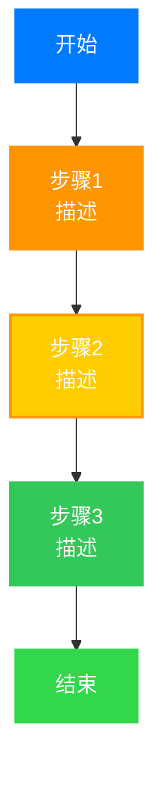
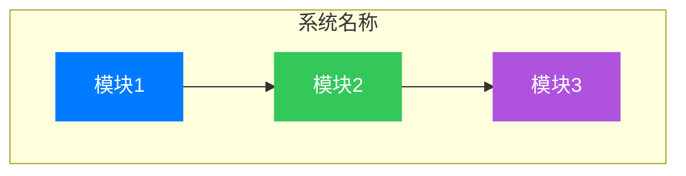
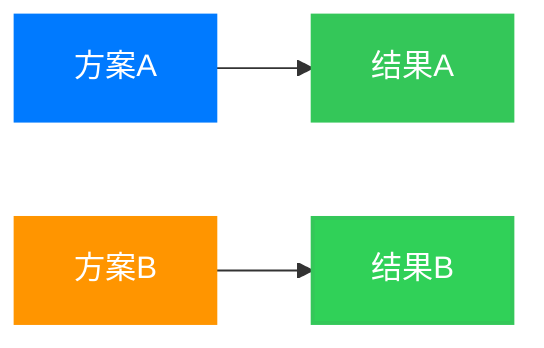
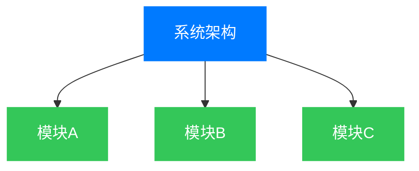

# 技术文章插图美化指南

本文档总结了技术文章中美化图表的完整流程、配色标准和最佳实践。

## 核心原则

### 1. 视觉清晰度优先
- 所有图表文字必须使用白色（`#ffffff`），确保在彩色背景上清晰可读
- 避免使用浅色背景上的深色文字
- 确保图表在移动端和桌面端都有良好的可读性

### 2. 配色风格统一
- 使用苹果风格的清新高雅配色体系
- 全文章保持一致的配色语言
- 不同类型的元素使用不同颜色，但色系要协调

### 3. 内容与形式并重
- 图表应服务于内容，而不是单纯装饰
- 在合适的位置添加图表，帮助读者理解复杂概念
- 图表应能独立传达完整信息

## 苹果风格配色方案

### 主色调
```yaml
蓝色系:
  主色: "#007AFF"    # 苹果标准蓝 - 主要步骤、核心内容
  辅色: "#5AC8FA"    # 天蓝色 - 次要元素、支撑内容

绿色系:
  主色: "#34C759"    # 苹果绿 - 成功、完成、结果、硬件、软件
  次色: "#30D158"   # 深绿色 - 实现阶段
  强调: "#32D74B"   # 亮绿色 - 最终成果

橙色系:
  主色: "#FF9500"    # 苹果橙 - 警告、分析、评估
  次色: "#FFCC00"    # 金黄色 - 次级警告

红色系:
  主色: "#FF3B30"    # 苹果红 - 风险、错误、关键问题、最高等级

紫色系:
  主色: "#AF52DE"    # 苹果紫 - 复杂分析、中间步骤、支持过程

灰色系:
  主色: "#8E8E93"    # 苹果灰 - 辅助信息、参考等级
  背景: "#F2F2F7"    # 浅灰背景
```

### 配色应用原则
1. **流程图**：使用蓝色到绿色的渐变，表示从开始到完成
2. **架构图**：使用不同颜色区分不同模块或层级
3. **对比图**：使用对比色（如蓝vs橙、绿vs红）区分不同方案
4. **风险图**：红色表示高风险，橙色表示中风险，绿色表示安全

## Mermaid图表标准

### 基础配置
```mermaid
%%{init: {'theme':'base','themeVariables': {
  'fontSize':'16px',
  'fontFamily':'Arial, sans-serif'
}}}}%%
```

### 样式定义规范
```mermaid
style NodeID fill:#颜色,stroke:#边框色,stroke-width:宽度px,color:#ffffff
```

#### 边框宽度规范
- **3px**: 核心节点、起点、终点
- **2px**: 重要节点、中间步骤
- **1px**: 次要节点、辅助元素

### 文字颜色规范
- 所有节点文字：`color:#ffffff`（白色）
- 所有连线文字：`color:#ffffff`（白色）

## 常用图表类型模板

### 1. 流程图


### 2. 系统架构图


### 3. 对比图


### 4. 层级关系图


## 图表添加位置指南

### 1. 方法论部分
在介绍分析方法时，添加流程图：
- FMEA、FTA、STPA、HARA、TARA等方法的步骤流程图
- 使用渐进的蓝色→橙色→绿色配色表示过程进展

### 2. 系统架构部分
在介绍系统或标准结构时，添加架构图：
- ISO 26262的12部分体系图
- 系统分解结构图
- 使用不同颜色区分不同部分或模块

### 3. 对比分析部分
在进行方法对比或标准对比时，添加对比图：
- 不同方法的对比
- 不同标准的对比
- 使用对比色（蓝vs橙、绿vs红）

### 4. 风险分析部分
在进行风险或安全分析时，添加风险图：
- ASIL等级金字塔
- 风险评估矩阵
- 使用红色表示高风险，绿色表示安全

## 图表设计最佳实践

### DO（应该做的）
- ✅ 为每个图表添加清晰的标题
- ✅ 使用subgraph对相关元素进行分组
- ✅ 为复杂图表添加图例说明
- ✅ 保持图表的简洁性，避免过度复杂
- ✅ 确保图表在移动端可读
- ✅ 使用箭头标注流程方向
- ✅ 为节点添加简短描述

### DON'T（不应该做的）
- ❌ 使用深色背景上的深色文字
- ❌ 过度装饰图表元素
- ❌ 使用太多颜色造成视觉混乱
- ❌ 创建过于复杂的图表难以理解
- ❌ 使用不一致的配色方案
- ❌ 忽略图表的可访问性

## 常见转换场景

### ASCII图 → Mermaid图
**转换前（ASCII风格）：**
```
系统架构
│
├─ 模块A
├─ 模块B
└─ 模块C
```

**转换后（Mermaid风格）：**


### 表格增强
虽然表格本身不是mermaid图，但可以通过以下方式美化：
- 使用清晰的列标题
- 添加适当的空行分隔
- 使用表格说明图表数据
- 在表格后添加总结性的mermaid图

## 工作流程

### 阶段1：规划
1. 阅读文章内容，识别关键概念和流程
2. 确定哪些部分需要图表辅助说明
3. 选择合适的图表类型（流程图、架构图、对比图等）

### 阶段2：设计
1. 使用苹果风格配色方案
2. 创建mermaid图代码
3. 确保所有节点都有白色文字

### 阶段3：集成
1. 将mermaid图插入到文章合适位置
2. 添加图表标题和说明文字
3. 验证图表渲染效果

### 阶段4：验证
1. 检查图表在桌面端的显示效果
2. 检查图表在移动端的显示效果
3. 确保图表与内容一致

## 维护指南

### 定期检查清单
- [ ] 所有mermaid图使用统一的配色方案
- [ ] 所有节点文字都是白色
- [ ] 图表在不同屏幕尺寸下都能正常显示
- [ ] 图表风格与文章其他图表一致
- [ ] 图表内容与文章正文一致

### 更新流程
当发现需要美化或更新图表时：
1. 备份原始文件
2. 使用本文档提供的配色方案
3. 更新mermaid图代码
4. 验证渲染效果
5. 提交更新

## 参考资源

### 配色工具
- Apple Human Interface Guidelines
- Material Design Color System
- 在线配色工具：Coolors、Adobe Color

### Mermaid文档
- [Mermaid官方文档](https://mermaid.js.org/)
- [Mermaid配色示例](https://mermaid.js.org/syntax/flowchart.html)

### 示例文章
以下文章已经按照本指南进行了美化：
- `2026-01-01-iso26262-overview.md`
- `2026-01-05-iso26262-9-asil.md`
- `2026-01-11-iso26262-3-concept.md`
- `2026-01-16-automotive-risk-analysis-overview.md`
- `2026-01-16-hara-automotive-analysis.md`
- `2026-01-16-tara-analysis.md`

## 版本历史

- **v1.0** (2026-01-19)
  - 初始版本
  - 定义苹果风格配色方案
  - 提供图表模板和最佳实践
  - 记录已美化的文章列表

---

**最后更新**: 2026-01-19
**维护者**: AI Assistant
**状态**: 活跃维护中
